# Lecture STT Architecture

기준일: 2026-07-26

## 목적
- iCloud inbox에 들어오는 강의·회의·대화·개인 메모 음성 파일을 자동으로 전사한다.
- 전사 결과를 TXT/JSON과 metadata-only quality sidecar로 저장한다.
- 후단 correction/summary 산출물을 별도 배포하고, Hermes operator가 교정/요약 자동화를 앱 외부 계층에서 수행할 수 있게 한다.
- 현재 운영 호환성을 유지하면서 향후 시간표 기반 분류·자동 제목·모바일 대시보드·온디맨드 워커 구조로 이행한다.

## 시스템 경계

```mermaid
flowchart LR
    PHONE["iPhone 단축어"] --> ICLOUD["iCloud inbox"]
    ICLOUD --> WATCHER["Polling + 안정화 확인"]
    WATCHER --> STAGING["로컬 inbox staging"]
    STAGING --> PIPELINE["Python STT pipeline"]
    PIPELINE --> PROFILE["버전 전사 프로필"]
    PROFILE --> ENGINE["faster-whisper"]
    ENGINE --> POST["후처리 + 품질 점검"]
    POST --> V1["현행 v1 원본·전사 보관소"]
    POST --> DB["현행 jobs.sqlite3"]
    V1 --> HERMES["격리 Hermes operator"]
    HERMES --> OUTPUT["교정본·요약본"]
    DB --> PANEL["React 웹 패널"]
    PANEL --> PIPELINE

    DB -. "일관된 SQLite backup" .-> SNAPSHOT["독립 legacy DB snapshot"]
    SNAPSHOT -. "immutable read-only plan" .-> IMPORTER["Storage v2 preserve-first importer"]
    V1 -. "원본 변경 없는 hash/copy" .-> IMPORTER
    SNAPSHOT -. "ownerless delivery 원장" .-> RECON["Read-only archive reconciliation"]
    ARCHIVE["현행 GH archive"] -. "현재 route 경로·해시" .-> RECON
    OLDARCHIVE["명시적으로 허용한 과거 archive root"] -. "과거 revision 경로·해시" .-> EVIDENCEPLAN["Archive evidence plan"]
    RECON -. "정본 선택 없는 보존 후보" .-> EVIDENCEPLAN
    ARCHIVE -. "현재 revision 재검증" .-> EVIDENCEPLAN
    EVIDENCEPLAN -. "count + plan SHA + allow-write" .-> EVIDENCE["별도 archive-evidence root"]
    EVIDENCEPLAN -. "case/capture/revision/observation" .-> V2DB
    V2DB -. "on-demand metadata API" .-> REVIEWAPI["Archive review API"]
    REVIEWAPI -. "explicit guarded promotion" .-> V2DB
    TIMETABLE["학기별 CSV/JSON 시간표"] -. "CLI-only plan/apply" .-> TTPLAN["Timetable import + classification plan"]
    TTPLAN -. "count + plan SHA + allow-write" .-> V2DB
    V2DB -. "on-demand metadata API" .-> TTREVIEW["Timetable review API"]
    TTREVIEW -. "audit-only explicit confirmation" .-> V2DB
    TTREVIEW -. "confirmed proposal" .-> TTMAT["CLI-only canonical materialization"]
    TTMAT -. "disabled gate + count + plan SHA + allow-write" .-> V2DB
    TTMAT -. "atomic replace + forward recovery" .-> V2
    V2 -. "verified latest transcript bytes" .-> TITLEPLAN["CLI-only content title suggestion"]
    V2DB -. "recorded time + selected context + active timetable proposal" .-> TITLEPLAN
    TITLEPLAN -. "disabled gate + count + hidden-evidence plan SHA + allow-write" .-> V2DB
    TITLEPLAN -. "audit-only explicit confirm/reject" .-> V2DB
    V2DB -. "on-demand metadata API" .-> TITLEREVIEW["Title suggestion review API"]
    TITLEREVIEW -. "guarded reject + audit-only confirmation" .-> V2DB
    TITLEREVIEW -. "fresh gated detail" .-> TITLEWORKBENCH["React title review workbench"]
    TITLEWORKBENCH -. "exact title deep link" .-> PANEL
    V2DB -. "confirmed content-title proposal" .-> TITLEMAT["CLI-only content-title materialization"]
    TITLEMAT -. "disabled gate + count + plan SHA + allow-write" .-> V2DB
    TITLEMAT -. "title-only atomic replace + forward recovery" .-> V2
    V2DB -. "bounded current-job metadata" .-> ANALYTICS["Read-only transcription analytics"]
    V2 -. "bounded quality scorecard metadata" .-> ANALYTICS
    ANALYTICS -. "day/week/month on-demand" .-> PANEL
    ANALYTICS -. "Prometheus text scrape" .-> METRICS["Prometheus/Grafana-compatible metrics"]
    V2DB -. "bounded recording/job/artifact/review metadata" .-> LIBRARYAPI["Read-only recording library API"]
    LIBRARYAPI -. "list/detail on-demand" .-> PANEL
    V2DB -. "single read transaction" .-> UNIFIEDAPI["Read-only unified review feed API"]
    UNIFIEDAPI -. "exact totals + canonical pagination" .-> UNIFIEDREVIEW["React unified review queue"]
    UNIFIEDREVIEW -. "exact hash deep link" .-> PANEL
    IMPORTER -. "명시적 apply 전용" .-> V2["Storage v2 records/<storage_key>"]
    IMPORTER -. "운영 DB에는 아직 미적용" .-> V2DB["별도 Storage v2 DB"]
    V2 --> V2DB
```

## 최상위 디렉터리
- `src/`: 애플리케이션 본체
- `frontend/`: React 웹 패널 소스(Vite 기반)
- `scripts/`: 수동 실행, 설치, 운영 보조 스크립트
- `scripts/hermes_postprocess/`: Hermes cron/operator용 repo-local 후보 discovery, prompt loading, validator, review-only misrecognition queue, staging manifest, explicit promote helper
- `launchd/`: macOS launchd 서비스 정의 템플릿
- `config/`: YAML 설정 템플릿. 운영 `config.yaml`은 gitignore 대상이다.
- `tests/`: Python unittest suite
- `docs/`: 운영 runbook, architecture, worklog, model/operator 문서
- `migrations/v2/`: 운영 DB와 분리해 검증하는 additive storage/DB v2 SQL migration
- `.github/workflows/`: GitHub Actions CI
- `.codex/agents/`: project-local Codex subagent 설정
- `.hermes/plans/`: 승인/작업 계획 기록
- `state/`: gitignored repo-local SQLite DB, operator staging, reports, lock/pause files
- `tmp/`: gitignored legacy/local fallback tmp. 현재 운영 STT tmp/cache 기본값은 `~/Library/Caches/lecture_stt/tmp`다.

## 현재 소스 구조
- 실제 구현 코드는 `src/lecture_stt/` 패키지 아래에 정리되어 있다.
- `src/lecture_stt/stt/`: 메인 STT 파이프라인
- `src/lecture_stt/shared/`: 공용 DB, 유틸
- `src/lecture_stt/storage_v2/`: immutable legacy snapshot discovery, record manifest, preserve-first importer, timetable classification/materialization, transcript-content title suggestion/materialization, library snapshot/verifier, bounded recording library/analytics adapter
- `src/lecture_stt/correction/`: 수동/provider-neutral correction 대기 상태 조회와 correction prompt helper
- `src/lecture_stt/downstream/`: correction/summary 배포 파이프라인
- `src/lecture_stt/ui/`: 웹 제어판
- 운영 스크립트는 `PYTHONPATH=<repo>/src python -m lecture_stt...` 방식으로 패키지를 직접 실행한다.
- `src/lecture_stt/stt/profiles.py`가 버전이 있는 전사 프로필과 설정 hash를 관리한다.

## 메인 STT 파이프라인
- 메인 진입점 모듈은 `src/lecture_stt/stt/main.py`다.
- `load_config()`와 `validate_config()`가 설정 파일을 읽고 경로, ffmpeg, 쓰기 권한을 검증한다.
- `STTPipeline`이 전체 작업을 오케스트레이션한다.
- `PollingWatcher`가 inbox 폴더를 polling하면서 일정 시간 이상 변하지 않은 파일만 안정 파일로 판단한다.
- 안정 파일은 먼저 로컬 `tmp/inbox_staging`으로 선점 이동한 뒤 `01_audio`로 옮겨, iCloud rename/sync 영향이 전사 중간 단계로 번지지 않게 한다.
- 워커 시작 시 `tmp/inbox_staging`에 남아 있던 중단 파일과 `01_audio`에만 남은 pre-claim pending 오디오는 다시 inbox로 되돌려 재처리하고, 대응되는 stale job row도 정리한다.
- 같은 SHA-256의 `DONE` 또는 `NEEDS_REVIEW` 작업이 있으면 기존 결과를 복제해 dedupe 처리한다. 원본 작업이 검토 상태라면 새 작업도 성공으로 승격하지 않고 `NEEDS_REVIEW`를 유지한다.
- 입력 stem은 NFC로 정규화하고 Unicode 문자·숫자를 보존한다. macOS/iCloud의 NFD 한글 파일명도 더 이상 `audio`로 붕괴하지 않는다.
- `profiles.active`가 있으면 선택한 프로필의 transcribe override, 후처리 교정표, 품질 임계값을 적용한다. 프로필 설정이 없는 기존 config는 처리 동작을 바꾸지 않는 `legacy/unversioned` 프로필로 기록한다.
- 중복이 아니면 `STTWorker`가 ffmpeg로 WAV 전처리 후 faster-whisper 전사를 수행한다.
- 전사 결과는 `postprocess()`로 세그먼트와 전체 텍스트의 반복/노이즈/오인식 용어를 정리한다. 프로필의 `corrections: {}`는 범용 녹음에서 기존 강의 용어 교정을 끈다.
- `quality_gate.evaluate()`가 반복도와, 길이를 알 수 있는 오디오의 전사 밀도·시간 커버리지를 계산해 메타데이터에 포함한다.
- 최종 산출물은 `02_transcripts` 아래 `{base}.txt`, `{base}.json`으로 저장되고, 품질 메타데이터가 있으면 `{base}.quality.json` scorecard sidecar도 함께 저장된다. Scorecard는 transcript 본문과 segment 배열을 제외한 metadata-only artifact이며 profile `key/version/config_sha256` snapshot을 포함할 수 있다.
- 품질 `bad` 결과는 산출물을 보존하되 정상 성공으로 알리지 않고 DB 상태를 `NEEDS_REVIEW`로 기록하며 별도 review 알림을 보낸다.
- STT 실행 실패는 기본 2회까지 retryable 상태(`전사 재시도 대기 n/2`)로 DB에 남기고, 다음 scan에서 즉시 재시도한다.
- retry 한도 초과 후 terminal failure가 되면 오디오는 `99_errors`로 이동하고 DB 상태는 `ERROR`로 기록된다.
- DB `engine_params`에는 `transcription_failures`, `transcription_max_retries`, `last_error_message`를 secret-redacted 형태로 남긴다.
- 알림 계층은 `notification.provider` 설정과 `.env` secret을 기준으로 Telegram 또는 Discord provider를 선택한다.
- `notification.dual_send_providers`를 사용하면 전환 기간 동안 다중 채널 shadow 전송을 할 수 있다.

## 메인 파이프라인 핵심 모듈
- `src/lecture_stt/stt/main.py`: 설정 로드, 파이프라인 오케스트레이션, 상태 전이, 복구
- `src/lecture_stt/stt/watcher.py`: 안정 파일 감시
- `src/lecture_stt/stt/transcribe.py`: ffmpeg 전처리, Whisper 전사
- `src/lecture_stt/stt/postprocess.py`: 반복/점 노이즈 제거, 용어 교정
- `src/lecture_stt/stt/profiles.py`: 프로필 스키마 검증, 활성 프로필 병합, 버전/hash snapshot
- `src/lecture_stt/stt/quality_gate.py`: 품질 보고서와 metadata-only quality scorecard 생성
- `src/lecture_stt/stt/notifier.py`: Telegram/Discord notifier, 중복 방지 마커, provider 팩토리
- `src/lecture_stt/shared/utils.py`: 파일 이동, atomic write, hash, pause flag 등 공용 함수
- 메인 워커는 `state/stt.lock` 파일 락으로 단일 인스턴스를 보장하고, claim 전에 원본이 사라진 경우는 다른 워커 선점 또는 외부 rename 가능성으로 보고 경고 후 skip한다.
- scheduled cleanup은 `tmp/`를 정리하되 `tmp/inbox_staging`은 보존해 복구 대기 중인 claimed input을 삭제하지 않는다.
- scheduled cleanup은 DB의 미해결 `NEEDS_REVIEW` canonical stem을 먼저 읽어 해당 원본·전사·quality 세트를 보존한다. 이 보호 목록을 읽을 수 없으면 apply를 거부한다.

## 상태 저장
- `src/lecture_stt/shared/db.py`가 SQLite 스키마와 접근 로직을 담당한다.
- `jobs` 테이블은 STT 메인 파이프라인 상태를 저장한다.
- 주요 상태는 `PENDING`, `PROCESSING`, `DONE`, `NEEDS_REVIEW`, `ERROR`다.
- `NEEDS_REVIEW`는 전사 산출물은 유효하지만 자동 후속 처리 전에 사용자가 품질을 확인해야 하는 상태다. 시스템 실패인 `ERROR`와 구분한다.
- 진행률, ETA, dedupe 정보, 에러 메시지, 처리 시간까지 함께 저장한다.
- 시작 시 `recover_processing_jobs()`가 중단된 `PROCESSING` 작업을 복구한다.
- 복구 시 transcript metadata에 품질 보고서가 있는데 scorecard sidecar만 없는 저장 직후 crash window라면 metadata-only scorecard를 결정적으로 재생성한 뒤 검증한다. Sidecar가 malformed이거나 재생성할 수 없으면 산출물을 삭제하지 않고 `NEEDS_REVIEW`로 격리한다.

## 제어 계층
- 현재 주 제어 UI는 `src/lecture_stt/ui/web_panel.py`다.
- 웹 제어 백엔드 상태/워커 제어 로직은 `src/lecture_stt/ui/web_panel_state.py`로 분리되어 있다.
- 내장 HTTP 서버가 워커 시작, 일시정지, 재개, 중지, 로그 tail, DB 상태 조회를 제공한다.
- 웹 제어 계층은 `config.yaml`의 `notification` 섹션도 수정할 수 있으며, 패널에서 텔레그램/디스코드/둘 다/끄기 선택을 저장한다.
- React 빌드 산출물이 있으면 내장 HTTP 서버가 `/`에서 메인 웹 패널과 정적 자산을 서빙한다.
- React 소스는 `frontend/web-panel/`에 있으며, Vite + React + TypeScript 기반으로 유지한다. 현재 client는 typed decoder, TanStack Query, Vitest와 Python static serving 경계가 이미 분리되어 있어 언어/프레임워크 재작성으로 확인된 리소스 이득이 없다. Controller/worker 경계와 idle I/O를 먼저 개선한다.
- 프론트 데이터 계층은 `src/lib/panelApi.ts`, `src/lib/panelEvents.ts`, `src/lib/decodePanelState.ts`, `src/lib/logParser.ts`, `src/hooks/usePanelState.ts`, `src/hooks/usePanelLogs.ts`로 나뉜다.
- 패널 UI는 `src/components/panel/`과 `src/components/ui/`의 로컬 재사용 컴포넌트로 나누고, `App.tsx`는 화면 조합만 담당한다.
- panel state 조회와 action 이후 refetch/invalidation은 TanStack Query가 담당한다.
- 상단 알림 토글은 `.env` secret 존재 여부를 기준으로 선택 가능한 알림 채널만 순환 표시하고, 선택 시 `/api/notification`으로 `config.yaml`을 갱신한다.
- 실행 중 워커가 있으면 알림 채널 저장 요청이 같은 API 호출 안에서 워커 재시작까지 이어져 즉시 반영된다.
- 실시간 갱신은 `GET /api/events` SSE를 우선 사용하며, 서버는 `state`, `log_chunk`, `log_reset` 이벤트를 스트리밍한다.
- 클라이언트는 SSE가 연결되어 있는 동안 polling을 멈추고, 스트림이 실패하거나 브라우저가 `EventSource`를 지원하지 않으면 기존 `/api/state`, `/api/logs` polling으로 fallback 한다.
- `/api/events`의 bare 요청은 기존처럼 state+logs를 함께 제공한다. 화면별 절전 경계에서는 `?streams=state`를 사용하며, 이 연결은 서버에서 `_log_stream_delta()`를 호출하지 않는다. `streams`는 `state`, `logs` 또는 둘의 쉼표 조합만 허용하고 빈 값·중복·알 수 없는 값은 400으로 거부한다.
- React 패널은 hash 기반 `홈`, `처리 현황`, `녹음 보관함`, `검토 큐`, `시간표`, `설정` 화면 경계를 가진다. `처리 현황`에서만 Activity 로그 훅과 combined SSE를 활성화하고, 다른 화면은 state-only SSE를 사용한다. 처리 화면으로 전환할 때는 화면 상태에서 combined endpoint를 동기적으로 계산한 뒤 state/log 훅이 같은 singleton에 합류해 state-only와 combined `EventSource`가 중복 생성되지 않게 한다. Storage v2 패널은 해당 화면에서만 mount하며 analytics, recording library, archive review, timetable, title review와 unified feed query를 SSE snapshot에 합치지 않는다.
- 화면 index는 desktop에서 sticky rail, 900px 이하에서 3열, 560px 이하에서 설명을 접은 2열 grid로 바뀐다. 모바일에서 현재 화면이 수평 스크롤 밖으로 숨지 않으며 긴 storage path는 카드 안에서 줄바꿈한다.
- 화면이 바뀌어도 패널 state query와 기존 worker action 계약은 유지한다. 녹음 보관함은 legacy 운영 job count·folder 경계가 아니라 별도 Storage v2 list/detail API만 on-demand로 읽고, 추정 데이터나 웹 업로드 UI를 만들지 않는다.
- 최근 작업과 로그는 분리 카드 대신 하나의 Activity 패널로 묶어, 최근 작업 행 선택과 해당 작업 중심의 한국어 운영 로그 확인을 한 흐름으로 제공한다.
- 현재 패널은 `NEEDS_REVIEW`를 `확인 필요`로 집계·표시하며 `ERROR`와 분리한다. 구형 schema v2 payload에 해당 count가 없으면 0으로 해석한다.
- Activity 패널의 로그 영역은 raw log를 그대로 유지하되, `logParser.ts`가 반복 패턴을 파싱해 과목/날짜/요일/교시를 포함한 한국어 운영 로그 뷰와 오류 전용 뷰를 함께 제공한다.
- pause/resume는 별도 IPC 대신 `state/paused` 플래그 파일로 제어한다.
- Tk 기반 구형 GUI는 제거했고, 운영 제어면은 웹 패널로 단일화한다.
- Archive evidence 검토 API는 평시 SSE snapshot에 포함하지 않고 `/api/storage-v2/archive-evidence/cases` 아래 on-demand endpoint로 분리한다. 목록/상세는 metadata-only이며 revision 본문, evidence source 상대경로, 원본 root를 반환하지 않는다.
- 상태 변경은 `storage_v2.archive_review.status_writes_enabled`와 요청의 `allow_write`가 모두 참이어야 한다. Canonical 제안은 ledger 일치 revision이 유일할 때 우선하고, 그렇지 않으면 최신 capture의 current revision이 유일할 때만 제안하며 자동 확정하지 않는다.
- Canonical promotion은 evidence 파일을 복사·이동하거나 새 recording을 자동 생성하지 않는다. 사용자가 고른 revision을 기존 Storage v2 recording에 감사 가능한 metadata로 연결하며, `promotions_enabled`, `allow_write`, `expected_count`, 정확한 plan SHA-256을 모두 요구한다. 기본 설정은 비활성화다.
- 시간표 파일 입력은 웹 업로드가 아니라 `plan-timetable`/`apply-timetable` CLI만 사용한다. UTF-8 CSV/JSON의 학기·과목명·요일·시작/종료 시각·교시·강의실을 NFC 정규화하고, source path/원문은 DB/API에 남기지 않는다. Apply는 현재 file digest에서 다시 만든 count·plan SHA-256과 `allow_write`를 모두 요구한다.
- 녹음 분류는 지정 학기의 timetable과 `recorded_at` 요일/시각을 보수적으로 대조한다. 유일 후보도 `recording_classification_proposals.status=suggested`와 open `review_items`만 만들며, 후보 없음·복수·녹음 시각 부재/오류도 같은 검토 큐로 보낸다. 이 단계에서는 transcript 본문을 추론 입력으로 사용하지 않는다.
- `/api/storage-v2/timetable/entries`와 `/api/storage-v2/timetable/classifications`는 평시 SSE에 넣지 않는 on-demand metadata API다. 웹 업로드나 자동 분류 실행 endpoint는 없고, proposal 목록·상세·명시적 reject와 confirmation plan/apply만 제공한다. API, status write, confirmation은 각각 actual YAML boolean 설정으로 기본 비활성화한다.
- React 패널의 `TimetablePanel`도 이 on-demand API를 별도 TanStack Query로 읽는다. 학기 필터가 없으면 active 학기들을 학기 열로 구분하고, review row는 `status=suggested`만 조회하며 confirmed/rejected는 집계에만 표시한다. 900px 이하에서 한 열로 전환하고 표 overflow는 카드 내부에 가둔다. UI는 proposal 상세에서 명시적 보류(rejected/dismissed)와 confirmation plan/apply를 노출하지만, reject는 별도 inline 확인 단계를 거치고 confirmation도 먼저 read-only plan을 본 뒤 exact `expected_count=1`과 plan SHA-256으로만 apply한다.
- `rejected` 전이는 suggested proposal과 연결된 review를 `dismissed`로 함께 바꾸며 title/context/manifest에는 쓰지 않는다. Rejected 이력은 보존하되 같은 recording+semester의 새 active suggestion은 다시 만들 수 있다. 반대로 동일한 suggested/confirmed 제안은 분류 재실행에서 멱등하게 건너뛴다.
- Confirmation은 suggested와 confirmed 상태를 명시적으로 분리하고 review를 resolved로 전환하는 audit-only 결정이다. `confirmations_enabled`, `allow_write`, `expected_count=1`, 정확한 plan SHA-256을 모두 요구하며 그 자체로는 `recording_titles.is_current`, `recording_contexts.is_selected`, `manifest.json`을 바꾸지 않는다.
- Confirmed `unique_time_match`를 정본에 반영하는 별도 `plan-timetable-materialization`/`apply-timetable-materialization` CLI가 있다. 웹/API에서는 노출하지 않고 apply는 기본 비활성 `--enable-materialization`, `--allow-write`, `expected_count=1`, exact plan SHA-256을 모두 요구한다. 새 title/context row와 `prepared` journal을 먼저 commit하고 같은 디렉터리 임시 파일을 `fsync`한 뒤 manifest를 `os.replace`하며, 마지막 transaction에서 current/selected와 journal을 `applied`로 전환한다. 두 transaction 사이에서 중단되면 old/new manifest digest 중 정확히 하나만 인정해 같은 plan으로 forward recovery한다.
- `/api/storage-v2/title-suggestions`는 평시 SSE에 넣지 않는 제목 proposal 목록·상세 metadata API다. `storage_v2.title_review.enabled`가 실제 YAML boolean `true`일 때만 DB를 열고 기본값은 `false`다. 목록은 suggested/confirmed/rejected 집계와 bounded proposal metadata만, 상세는 제안 당시 분류 상태와 현재 linked classification만 반환한다. Transcript 본문·발췌, artifact 경로·digest, recording/job/artifact numeric id는 반환하지 않으며 내부 오류는 경로를 숨긴 503으로 닫는다.
- 제목 보류는 `status_writes_enabled`와 요청 `allow_write`가 모두 참일 때 proposal을 rejected, review를 dismissed로 전환한다. Confirmation plan은 exact transcript와 현재 inference metadata를 재검증한 `expected_count=1`/SHA-256을 반환하고 apply는 별도 `confirmations_enabled`와 `allow_write`까지 요구한다. Confirmation은 audit-only로 proposal/review만 confirmed/resolved로 바꾸며 current title, selected context, storage key와 manifest를 바꾸지 않는다. 웹에는 proposal 생성·canonical materialization·upload endpoint가 없다.
- Confirmed content-title을 정본 제목에 반영하는 경로는 웹/API와 분리된 `plan-title-materialization`/`apply-title-materialization` CLI뿐이다. Apply는 기본 비활성 `--enable-materialization`, `--allow-write`, `expected_count=1`, exact plan SHA-256을 요구한다. 현재 title, transcript bytes·artifact, inference 입력, linked review, proposal, manifest를 prepare 직전과 finalize 직전에 다시 검증하고, 새 `system` title revision과 `prepared` journal을 먼저 commit한 뒤 같은 디렉터리 temp의 `fsync`·`os.replace`와 마지막 `applied` transaction으로 전진 복구한다. Storage key, selected context, 원본·artifact 경로는 바꾸지 않으며 timetable materialization 이력과의 혼합 chain은 현재 revision에서 fail-closed한다.
- React `TitleSuggestionPanel`은 `#review/title/<canonical-positive-id>`에서 suggested 목록과 metadata-only 상세를 별도 TanStack Query로 읽는다. Mount 뒤 fresh 목록이 `available=true`를 증명하기 전에는 detail을 열지 않아 warm cache와 기본 비활성 deep link를 fail-closed한다. 첫 8건 밖의 exact deep link는 별도 detail로 유지하고, 보류는 2단계 확인, confirmation은 read-only plan을 먼저 표시한 뒤 capability가 켜진 경우에만 exact count/digest로 적용한다. 900px 이하에서는 선택 상세가 bounded 8건 목록보다 먼저 오는 실제 DOM 순서로 전환하고, 560px 이하 목록은 한 열로 표시한다.
- 녹음 보관함 API는 `/api/storage-v2/library/recordings?limit=<0..200>&offset=<0..100000>` 목록과 `/api/storage-v2/library/recordings/<storage_key>` 상세로 분리한다. `storage_v2.library.enabled`가 실제 YAML boolean `true`일 때만 열리고 example config는 기본 `false`다. 목록은 비활성 payload를 반환하며 detail은 403으로 닫힌다. Query key·중복·빈 값·canonical decimal과 detail path segment를 엄격히 검사하고, valid-but-missing key는 404, 내부 장애는 경로를 숨긴 503으로 반환한다.
- `src/lecture_stt/storage_v2/library.py`는 SQLite `mode=ro`와 Storage v2 schema 검증만 사용한다. 목록은 표시 이름/NFC 원본명, current title/selected context/current job, 상태·열린 review·artifact count를 반환한다. 상세는 최대 job 50개, artifact 500개, review 100개를 반환하며 실제 전체 count와 truncation을 함께 표시한다. Artifact 상한은 current/newest job 순위를 먼저 적용해 오래된 revision이 현재 job lane을 밀어내지 못하게 한다. Archived job/artifact는 revision lane과 correlation에서 제외하고, archived 연결을 가진 review 자체는 감사 이력으로 남기되 job/artifact 참조를 `null`로 닫는다.
- API는 numeric DB id, source/artifact 상대·절대경로, digest, transcript/correction/summary/scorecard 본문, review detail JSON, job config/error를 반환하지 않는다. React decoder도 NFC, 표시 이름, enum, JS-safe count, kind→stage, latest/current 유일성, 고정 detail 상한을 재검증한다. Detail query는 화면 mount 뒤 fresh list 응답이 `available=true`를 다시 증명한 경우에만 열리므로 warm cache나 기본 비활성 deep link가 metadata를 먼저 노출하거나 추가 403 요청을 만들지 않는다.
- React `RecordingLibraryPanel`은 hash `#library/<storage_key>`를 사용해 첫 페이지 목록과 선택 detail을 독립적으로 유지한다. 내부 `storage_key`와 사용자 표시 이름을 분리하고, 원본·전사·교정·요약·지원 artifact를 job별 revision lane으로 보여 주되 복잡한 폴더 구조는 노출하지 않는다. Hash는 한 개의 canonical ASCII key segment만 허용하며 malformed percent encoding과 extra segment는 detail을 열지 않는다.
- `/api/storage-v2/review-feed?limit=<0..200>&offset=<0..100000>`는 `storage-v2/unified-review-feed@2` 계약으로 archive case, suggested timetable proposal, suggested content-title proposal, recording-level open review 네 source를 서버에서 정본화하는 on-demand metadata-only API다. Source별 실제 YAML boolean gate를 그대로 따르고, Storage v2 DB를 `mode=ro`로 연 단일 read transaction에서 exact source total과 stable page를 계산한다. 알 수 없는·중복·빈 query와 비정규 decimal은 400, schema/query 내부 장애는 경로를 숨긴 503으로 fail-closed한다.
- 서버는 timetable/title proposal과 recording summary가 같은 `review_item_id`를 가리키는 경우 두 full-table link set의 합집합을 `DISTINCT`로 만든 뒤 recording rollup에서 먼저 차감한다. 따라서 현재 page 밖 proposal도 recording review로 중복 계산하지 않으며, 한 recording의 서로 다른 미연결 review도 각각 집계한다. Python 응답 메모리는 page 크기로 제한하고 source ledger의 `visible_count`, exact `total_count`, `truncated`를 함께 반환한다. ID, hash route, timestamp, JS-safe count와 표시 문자열은 응답 전에 검증·NFC 정규화하며 본문·경로·digest·numeric DB ID는 내보내지 않는다.
- React `UnifiedReviewPanel`은 검토 화면이 mount된 동안 이 endpoint 한 개만 page당 최대 100건 조회한다. Retry·window focus·reconnect polling을 하지 않고, 서버가 정렬한 순서를 그대로 표시하며 이전/다음 pagination과 source ledger를 제공한다. Warm cache는 mount 뒤 fresh 성공 또는 실패가 확인되기 전까지 숨긴다. 선택 대상이 있으면 실제 DOM을 source ledger → 선택 workbench → unified queue 순서로 두고 세 영역을 전폭 한 열로 표시하며, 선택 대상이 없을 때만 desktop ledger/queue 두 열을 유지한다.
- 통합 큐의 stable id와 native route는 `archive:<case_key>`→`#review/archive/<case_key>`, `timetable:<proposal_id>`→`#review/timetable/<canonical-positive-id>`, `title:<proposal_id>`→`#review/title/<canonical-positive-id>`, `recording:<storage_key>`→`#review/recording/<storage_key>`다. Malformed percent encoding, encoded slash, extra segment, unknown source와 비정규·JS-safe 범위 밖 proposal decimal은 검토 기본 화면으로 fail-closed한다. Exact route는 목록 첫 페이지 밖 대상도 기존 source panel의 별도 detail query로 열며 browser back/forward에서 선택을 복원한다.
- 상태 변경·reject·confirmation·canonical promotion은 unified feed에 새 mutation을 만들지 않고 기존 source workbench를 사용한다. 기본 비활성 설정과 plan/count/digest/allow-write guard도 그대로 유지한다.
- 전사 관제 지표는 `/api/storage-v2/analytics/transcriptions?period=day|week|month`의 독립 read-only endpoint로 제공한다. `/api/state`나 SSE payload에는 넣지 않고 홈 화면에서 선택한 기간 하나만 on-demand로 요청하므로, 다른 화면과 평시 대기 중에는 Storage v2 DB/root 집계를 만들지 않는다.
- 같은 집계를 `/api/storage-v2/analytics/transcriptions/metrics?period=day|week|month`에서 Prometheus text exposition으로 제공한다. 상태·품질 구간·확정 분류·양·coverage·freshness를 gauge family로 노출하고 HELP/TYPE은 family당 한 번만 출력한다. 별도 background exporter나 polling을 만들지 않으며 analytics gate가 꺼져 있으면 기존 read-only 비활성 경계를 그대로 따른다.
- `storage_v2.analytics.enabled`는 실제 YAML boolean `true`일 때만 열리고 example config 기본값은 `false`다. 활성화할 때도 운영 legacy DB가 아니라 별도 `storage_v2.db_path`와 명시적 `storage_v2.records_root`만 사용한다. 이번 변경은 설정 예시와 코드 경계만 추가했으며 운영 DB/root에는 연결하거나 migration/cutover하지 않았다.
- 집계 대상은 archive되지 않은 recording의 current transcription job이며, event 시각은 유효한 `recorded_at` → `received_at` → `queued_at` 순으로 선택한다. 같은 parser를 SQLite deterministic UDF와 최종 row 변환에 사용해 기간 필터를 `row_limit + 1`보다 먼저 적용한다. 미래·극단 offset·invalid timestamp가 상한을 선점하지 않으며 `Asia/Seoul` 기준 오늘 24개 시간 bucket, 최근 7일/30일의 일 bucket을 만든다.
- 품질 점수는 latest non-archived `quality_scorecard` artifact만 읽는다. Storage key와 상대경로를 검증하고 records root dirfd 아래 각 path component를 `O_NOFOLLOW`로 열어 regular single-link 파일인지 확인한 뒤 최대 256KiB(호출 상한 1MiB)를 stable metadata 상태에서 읽는다. 실제 bytes/SHA-256을 DB artifact metadata와 대조하고 exact integer schema version을 포함한 scorecard 계약을 검증하며, 깊은 JSON·변조·malformed·비현실적으로 큰 duration은 해당 row의 `quality_invalid`로 격리한다. Optional audio/processing duration은 부분합과 함께 각각의 known/jobs 표본 수를 노출한다. Scorecard의 transcript/correction/summary 본문, summary 문구, artifact 경로, digest, error message와 engine parameter는 API에 반환하지 않는다.
- Analytics DB 연결은 SQLite `mode=ro`로 table/schema write를 금지하면서 WAL-visible current row를 읽는다. Main DB와 WAL의 bytes·size·mtime·ctime은 읽기 전후 불변이어야 한다. SQLite가 read lock을 조정하며 `-shm` bytes/mtime/ctime을 바꿀 수 있으므로 이 sidecar는 identity·mode·link count·size 불변만 보장하며, filesystem byte-for-byte immutable snapshot 계약으로 표현하지 않는다.
- 점수가 없는 artifact와 malformed/unsafe scorecard는 각각 `quality_missing`, `quality_invalid`로 분리하고 평균 점수 분모에서 숨기지 않는다. 분류는 `recording_contexts.is_selected=1`만 확정 분류로 계산하며, suggested classification은 합치지 않고 `미분류` bucket과 coverage로 남긴다.
- React 홈은 Grafana식 기간·분포·추이 요약과 Falcon식 attention triage를 결합한 관제 화면으로 구성한다. 전사량·완료율·검토/오류·평균 품질 KPI, 처리량 추이, 품질 histogram, 상태/확정 분류 분포, 데이터 coverage/freshness, 최근 확인 항목을 표시한다. Attention 행은 같은 `storage_key`의 recording library detail로 명시적으로 연결하고, detail이 목록 첫 페이지 밖에 있어도 별도 read-only query로 유지한다. 새 chart/runtime 의존성이나 웹 업로드 UI는 추가하지 않고 기존 React+TypeScript, TanStack Query, semantic table/CSS bar 경계를 유지한다.

## Hermes postprocess operator package
- `scripts/hermes_postprocess/`는 앱 내부 LLM provider를 되살리지 않고 Hermes cron/operator 계층에서 쓸 결정적 보조 기능만 제공한다.
- `dry-run` CLI는 `02_transcripts`의 txt/json pair 중 final correction/summary가 완성되지 않은 stem 하나를 metadata-only JSON으로 반환한다. raw transcript body와 segment 배열은 stdout/report에 싣지 않는다.
- 후보에 quality scorecard가 있고 `health=bad`이면 자동 교정/요약 대상으로 선택하지 않는다. scorecard가 malformed이거나 health 계약이 잘못된 stem도 해당 후보만 fail-closed로 건너뛰며, scorecard가 없는 과거 산출물은 기존 동작을 유지한다.
- `paths.py`는 `02_transcripts`, `03_correction`, `04_summarize`, `05_prompt`, repo-local `state/hermes_postprocess/{staging,claims}` 경로를 계산하고 subject code를 longest-match로 추출한다.
- `prompts.py`는 existing iCloud `05_prompt/00_base_prompt.txt`, `01_common_glossary.txt`, 선택 subject glossary를 source of truth로 로드한다.
- `validators.py`는 correction JSON의 segment count, `id/start/end`, 전체 JSON key/order/array 구조, non-`text` metadata 보존, final overwrite 금지, summary required headings 및 `summary_too_short` guardrail을 검증한다.
- `misrecognitions.py`는 교정 중 발견한 짧은 오인식 후보 phrase를 repo-local `state/hermes_postprocess/misrecognitions/pending.jsonl`에 dedupe append한다. raw transcript excerpt/context와 `05_prompt` 자동 변경은 금지한다.
- `staging.py`는 metadata-only `manifest.json`과 explicit promote 인터페이스를 제공한다. Promote는 기본적으로 `promote_disabled`를 반환하며, `--allow-promote`가 없으면 final 경로에 쓰지 않는다. 허용된 promote도 candidate destination path를 재계산해 검증하고 validator를 재실행한 뒤 exclusive no-overwrite copy와 hash-checked rollback을 사용한다.
- child Hermes는 terminal/MCP 없이 `file,no_mcp` toolset으로 실행한다. 부모 환경 전체나 repo `.env`를 전달하지 않고 활성 provider에 필요한 환경 변수만 allowlist하며, 격리된 `HERMES_HOME`에는 활성 provider와 일치하는 OAuth credential entry만 담은 권한 `0600`의 최소 `auth.json` snapshot을 생성한다. 파일 도구는 repo `.env`와 child `auth.json`/`.env` 읽기를 명시적으로 거부한다.
- 이 패키지는 Gate A/B 개발·dry-run 검증 범위에서 시작했으며, 이후 승인된 Gate C+ promote canary와 Hermes cron 등록까지 반영됐다. 현재 활성화 범위와 금지사항은 `docs/operators/hermes-postprocess/README.md`와 `docs/OPERATIONS.md`를 우선한다.
- 2026-05-20 후속 승인으로 live stem `260504DS_1` 1건의 content staging, validation, Gate C+ promote canary를 수행했고, script-only Hermes cron job `lecture_stt_postprocess_operator`를 등록했다. Cron은 `state/hermes_postprocess/cron-baseline.json`의 activation-time backlog skip list를 사용해 기존 backlog를 건너뛰며, no-candidate일 때 stdout/delivery 없이 조용히 종료한다.
- `--lecture-root`는 iCloud가 아니어도 된다. 같은 폴더 구조의 local canary root를 넘기면 postprocess helper는 완전히 로컬에서 동작한다. iCloud는 현재 실제 transcript/prompt 정본 위치라 Gate B에서 read-only inventory 대상으로만 사용한다.

## Downstream 배포 파이프라인
- API-backed 자동 correction provider는 현재 비활성화되어 있으며, `src/lecture_stt/correction/worker.py`는 `02_transcripts`의 pending pair를 manual correction 대기 상태로만 보고한다.
- `CorrectionConfig`에는 API key/model/max token 필드가 없고, `correction.mode: manual`을 기본 운영 모드로 둔다.
- `src/lecture_stt/correction/corrector.py`는 외부 API 호출 구현을 갖지 않는 compatibility/helper 모듈이며, 자동 correction 시도는 명시적으로 실패한다.
- 진입점은 `src/lecture_stt/downstream/worker.py`다.
- correction 입력은 `03_correction` 폴더의 `{stem}.txt + {stem}.json` pair다.
- summary 입력은 `04_summarize` 폴더의 `{stem}.md`다.
- `src/lecture_stt/downstream/lib.py`가 stem 해석, 과목 라우팅, 무손실 복사, conflict 처리, cleanup, deliveries 상태 갱신을 담당한다.
- correction은 GH archive의 `06_lecture_notes/02_origin`으로 배포된다.
- summary는 GH archive의 `01_summarize`와 Obsidian 노트 경로 둘 다로 배포된다.
- summary는 correction 전달 완료가 확인된 경우에만 배포된다.
- 동일 내용은 hash 비교로 idempotent하게 처리하고, 다른 내용이 있으면 overwrite하지 않고 conflict로 남긴다.
- 반복되는 invalid/incomplete/blocked/conflict/error 이벤트는 같은 worker 프로세스 안에서 bounded suppression cache의 동일 key 기준 1회만 stdout/JSONL에 남겨 로그 폭주를 줄인다.
- scan 통계 로그는 최초, 통계 변화, 설정된 heartbeat 주기 때만 JSONL에 남기고 routine stdout은 기본적으로 끈다.
- `downstream.log_jsonl_max_bytes`를 0보다 크게 설정하면 `state/logs/downstream.jsonl`에 size guard/rotation을 적용한다. `downstream.log_suppression_max_keys`는 장기 실행 중 suppression cache 상한을 정한다. `downstream.log_routine_scan_events: false`이면 routine `scan_started`는 stdout/JSONL 모두 생략하고, routine `scan_completed`는 최초/변경/heartbeat만 JSONL에 남긴다. 기존 `downstream.out.log` truncate/delete나 launchd 재시작은 운영 승인 후 별도 절차로 처리한다.

## Downstream 상태 저장
- downstream 상태는 `deliveries` 테이블에 기록된다.
- correction/summary 각각의 상태, 대상 경로, hash, last error, 완료 플래그를 저장한다.
- `src/lecture_stt/downstream/status.py`가 요약 조회, 목록 조회, 상세 조회, row 삭제 CLI를 제공한다.

## 운영 스크립트와 서비스
- `scripts/run_worker.sh`: 메인 워커 상시 실행
- `scripts/run_once.sh`: 메인 워커 1회 실행
- `scripts/run_gui.sh`: 웹 제어판 실행
- `scripts/run_distribute.sh`: downstream 워커 실행
- `scripts/distribute_status.sh`: deliveries 상태 CLI 래퍼
- `scripts/benchmark_models.py`: baseline/current model과 승인된 후보 STT 모델을 비교하는 benchmark CLI 초안
- `scripts/setup_launchd.sh`: venv, 의존성, 모델, 폴더, launchd를 한 번에 설정
- `scripts/cleanup.py`: 오래된 audio/transcript/tmp 정리
- `scripts/hermes_postprocess/`: Hermes postprocess operator CLI. `python3 -m scripts.hermes_postprocess dry-run`으로 metadata-only 후보 discovery를 수행하고, `validate-correction`, `validate-summary`, `record-misrecognitions`, `promote` subcommand를 제공한다. Promote는 `--allow-promote` 없이는 final write를 하지 않는다.
- `launchd/com.geonha.lecture-stt.plist`: 메인 워커 상시 실행
- `launchd/com.geonha.lecture-stt-webpanel.plist`: 웹 제어판 상시 실행
- `launchd/com.geonha.lecture-stt-distribute.plist`: downstream 워커 상시 실행
- `launchd/com.geonha.lecture-stt-cleanup.plist`: 정리 작업 스케줄 실행

## 경로/설정 규칙
- 프로젝트 내부 리소스(`config/`, `state/`, `tmp/`, `frontend/web-panel/dist`)는 `repo_root()` 기준 상대경로로 해석한다.
- 사용자 데이터 경로(iCloud inbox, correction/summary, GH archive, Obsidian vault)는 코드 기본값으로 두지 않고 로컬 `config/config.yaml`에서 지정한다.
- `config/config.yaml`의 경로 값은 `~`와 `${VAR}` 환경변수 치환을 지원하고, 상대경로는 저장소 루트 기준으로 해석한다.
- `.env`는 secret뿐 아니라 운영 환경별 경로 override에도 사용할 수 있지만, 실제 외부 저장소 위치의 정본은 `config/config.yaml`이다.
- launchd plist는 저장소에 절대경로를 고정하지 않고 `scripts/setup_launchd.sh`가 현재 repo 위치로 템플릿을 렌더링해 등록한다.
- 현재 단계의 NFC 처리는 한국어 파일명·시간표 metadata·제안 제목 깨짐을 막는다. 내부 immutable storage key와 사용자 표시 이름은 분리되어 있다. 시간표+녹음 시각 기반 수업 분류와 검증된 transcript 내용 기반 제목은 서로 다른 proposal로만 제안되며 자동으로 정본이 되지 않는다. 두 confirmation 자체는 audit-only이고, confirmed proposal을 실제 정본에 반영하려면 각각의 기본 비활성 CLI materialization을 별도로 실행해야 한다.

## 리팩터링 이행 경계
- 2026-07-23 1차 단계는 기존 Python polling/launchd 운영을 유지한 채 filename 정규화, 버전 프로필, 품질 검토 상태와 현행 패널 호환성을 먼저 안정화한 것이다.
- storage v2 foundation은 `migrations/v2/0001_recording_store.sql`과 `docs/STORAGE_V2.md`에 별도 추가했다. 운영 DB에는 적용하지 않았으며, 임시 SQLite에서만 idempotency·FK·path·immutable key 제약을 검증한다. Migration은 legacy `jobs`/`deliveries` 테이블을 감지하면 persistent DDL 전에 중단하고, 적용 후 migration 파일 checksum과 table/index/trigger 정규화 서명을 모두 검증한다.
- v2 물리 정본은 `records/<storage_key>/` 한 곳에 녹음 1건의 `manifest.json`, 원본, job별 전사·교정·요약 revision을 묶는다. 한국어 제목·과목·날짜·교시는 경로가 아니라 title/context metadata다.
- `src/lecture_stt/storage_v2/`는 명시적으로 지정한 독립 legacy DB snapshot만 `immutable=1` read-only로 연다. regular file·single link·`quick_check`·본체 stat/hash·WAL/journal/SHM 안정성을 연결 전후와 조회 뒤에 확인한다. Snapshot identity는 plan digest에 포함하고 root lock 뒤와 commit 직전에도 재검증한다. 모든 legacy job을 먼저 조사해 source/artifact path·inode·delivery lineage를 전역 비교한 뒤에만 선택 필터를 적용한다.
- 신규 v2 DB와 root는 legacy root 밖에 둔다. 기존 DB는 non-mutating schema/checksum preflight 뒤 target pathname↔SQLite opened inode 및 main/WAL/SHM/journal link safety를 확인하고 writable 설정한다. Exclusive root lock, DB↔records-root binding, closed root inventory를 확인한 뒤 no-overwrite staging copy·file/directory/root/DB-parent `fsync`·manifest 작성·DB 등록 순서로 promote한다. Commit 결과가 불명확해도 이미 promote한 record를 지우지 않고 다음 실행에서 manifest/hash/tree/DB provenance를 정확히 검증해 복구한다.
- legacy delivery는 `deliveries.source_job_id`를 소유권 정본으로 사용한다. 같은 canonical base/path를 여러 job이 공유하면 명확한 owner에만 downstream artifact를 붙이고, 비소유 job에서는 제외한다. source-vs-transcript/correction/summary 역할 충돌이나 모호한 owner는 fail-closed다. `DELIVERED`의 SHA 불일치는 차단하지만 비성공 상태의 stale SHA는 실제 파일을 보존하고 review로 보낸다. 현재 source file이 모두 사라진 ownerless/unmatched delivery 125건은 임의 귀속하지 않고 목적지 아카이브 reconciliation 대상으로 남긴다.
- `reconcile-archive`는 이 125건만 독립 snapshot에서 읽어 현재 configured archive route와 대조한다. DB에 남은 과거 iCloud GH/Obsidian 절대경로는 직접 열지 않고 relocation provenance로만 기록하며, 현재 route 아래의 single-link regular file을 `O_NOFOLLOW`로 열어 같은 FD에서 해시한다. 출력은 경로·해시·상태만 포함하고 파일 본문은 포함하지 않는다.
- 2026-07-24 실데이터 대조에서는 125건 중 1건만 과거 delivery SHA와 현재 archive가 전부 일치했다. 교정 txt/json 123건, `DELIVERED` 요약 56건은 현재 파일과 저장 SHA가 달랐고, `MISSING` 요약 22건 중 9건은 현재 route에 파일이 존재했다. 따라서 124건은 자동 cut-over를 차단하고, 현재본과 남은 과거 revision을 함께 보존하는 후속 revision migration 대상으로 둔다.
- `archive_evidence_cases`는 recording FK 없이 ownerless delivery를 open review queue에 보존한다. 각 실행 관측은 immutable capture, 서로 다른 실제 바이트는 content-addressed revision, 현재 GH/Obsidian/과거 root의 발견 위치는 observation으로 분리한다. `blocked` classification은 revision copy를 막지 않고 canonical 승격만 막는다.
- `archive_evidence_canonical_selections`는 명시적으로 확정한 case별 artifact-kind revision과 promotion plan SHA-256을 immutable audit row로 남긴다. 승격은 기존 recording FK 연결과 case resolved 전이를 하나의 `BEGIN IMMEDIATE` transaction에서 수행하며 evidence/records filesystem에는 쓰지 않는다.
- `plan-archive-evidence`는 current route와 `--historical-root LABEL=PATH`로 명시적으로 허용한 과거 root만 연다. 모든 source는 root-bound single-link regular file인지 같은 FD에서 다시 해시하고, apply 직전에도 inode/크기/mtime/ctime/hash와 legacy DB snapshot이 plan과 같은지 확인한다. 허용하지 않은 recorded 절대경로는 metadata로만 남고 I/O 대상이 아니다.
- `apply-archive-evidence`는 운영 archive와 겹치지 않는 별도 root에 `cases/<case_key>/revisions/<kind>/<sha256>.<ext>`와 immutable capture manifest를 no-overwrite로 적재한다. exclusive root lock, closed tree inventory, `BEGIN IMMEDIATE`, count/plan SHA/write guard, pre/post full verifier를 거치며 파일이 먼저 promote되고 DB commit이 불명확한 경우 exact manifest/hash로만 recovery한다.
- archive evidence verifier는 DB quick/FK/canonical schema, case-capture-revision-observation 소속, canonical path, metadata-only manifest, 모든 revision hash와 closed root tree를 교차 확인한다. Capture snapshot은 고정 key와 status/classification/flag/token domain, canonical SHA-256, 절대 artifact path·확장자 계약만 허용하고, observation metadata는 single-link regular source의 고정 stat 7개만 허용한다. 자유 형식 issue message/expected/actual과 transcript/correction/summary 본문은 저장하지 않으며 DB와 manifest를 함께 변조한 경우에도 verifier가 거부한다. Dashboard용 snapshot은 case/review/capture/revision 집계만 내보내고 source 절대 root나 본문은 내보내지 않는다.
- Storage v2 write 경로는 운영과 분리된 `/private/tmp` canary에서 legacy job 290 한 건만 검증했다. 신규 recording 1건과 artifact 5개를 import한 뒤 전체 verifier가 issue 0을 반환했고, 같은 plan 재적용은 새 파일 없이 `skipped`로 끝났다. 운영 v2 DB, launchd, worker, iCloud v1 보관소는 바꾸지 않았다.
- archive evidence write 경로도 `/private/tmp/lecture-stt-archive-evidence-canary-final3-20260724.DbCe3d`에서 `260430DStr_2` 한 건만 검증했다. 현재 correction 2개, 현재 summary 1개, 과거 Obsidian의 서로 다른 summary 1개를 revision 4개와 observation 5개로 보존했고 verifier issue 0, DB-only snapshot open case 1, 재적용 `skipped`를 확인했다. Batch plan SHA-256은 `4f5db6f29dac82009817b3ce17a5d474caf924e5913ec8fab34cd045ae3cead0`이며 이 canary는 운영 v2 DB나 기존 archive를 수정하지 않았다.
- `schedule_imports`/`schedule_entries`는 학기별 source/normalized-entry digest와 정규화된 수업 시간을 보존하고, `schedule_semester_selections`가 과거 import를 삭제하지 않은 채 학기별 active import 하나를 가리킨다. 분류와 API 목록은 active import만 사용한다. `recording_classification_proposals`는 timetable entry와 recording/review 소속을 composite FK로 묶고 suggested/confirmed/rejected 상태, 제안 제목, 학기/과목/교시/강의실 metadata, confirmation plan SHA-256을 분리 저장한다. Partial unique index는 recording+semester당 suggested/confirmed active decision 하나만 허용하고 rejected 이력 뒤 재제안을 허용한다. Verifier는 import row count/entry digest/semester/active-selection plan digest, proposal↔schedule denormalized metadata, proposal↔review lifecycle과 닫힌 detail JSON을 교차 확인한다.
- `recording_title_proposals`는 학기 필수인 timetable classification과 분리된 범용 제목 감사 원장이다. Current job의 exact `transcript_raw_text` artifact, 선택적으로 내용에서 과목명/경계가 일치하는 과목 코드가 확인된 classification proposal, 전용 review item을 composite FK로 연결하고 recording당 active suggested/confirmed 제목 하나만 허용한다. `title_suggestions.py`는 records root lock 아래 모든 path component를 `O_NOFOLLOW`로 열어 regular single-link, bounded stable stat, DB bytes/SHA-256, strict UTF-8을 확인한다. 외부 모델 없이 exact course signal 또는 2~3개 bounded keyword만 사용하며 manual/schedule current title은 건너뛴다.
- 제목 plan 응답과 snapshot에는 제안 제목·NFC storage key·revision·상태·confidence만 남고 transcript 원문/발췌, artifact path, content digest, artifact/job/recording numeric id는 나오지 않는다. Apply plan digest에는 반환하지 않는 artifact identity/path/hash/bytes뿐 아니라 recorded timestamp, current title, selected context, active classification metadata를 포함해 결과 제목이 우연히 같아도 inference 입력 변경을 stale plan으로 거부한다. Apply는 독립 enable, allow-write, expected count, exact digest를 요구하고 read-only preflight 뒤 `BEGIN IMMEDIATE` 안에서 plan을 다시 만들며 commit 직전 파일/DB를 한 번 더 읽는다. Confirmation도 records root를 필수로 받고 현재 metadata와 transcript로 원래 제목 제안을 다시 계산해 proposal과 대조한다. 이 재계산 digest와 linked review/artifact/classification evidence는 lifecycle 전이 뒤에도 재구성 가능하게 구성해 read-only/exclusive/pre-commit 및 confirmed 멱등 replay에서 모두 검증한다. 생성·confirm·reject는 proposal/review만 바꾸고 canonical title/context/manifest는 바꾸지 않는다.
- `recording_classification_materializations`는 confirmation과 별개의 canonical-write journal이다. 이전/새 title·context row, confirmation/materialization plan digest, old/new manifest digest, 닫힌 metadata-only plan JSON과 `prepared`/`applied` 상태를 기록한다. Proposal touch trigger는 recursive trigger에서도 재귀하지 않으며 materialization은 plan의 target을 현재 proposal에서 다시 계산해 같은 시각의 stale mutation도 쓰기 전에 차단한다. 후속 materialization으로 대체된 applied journal의 재실행은 successor chain 전체와 최신 manifest를 검증한 뒤 `skipped`로 끝난다. Storage v2 read-only 연결도 main DB의 symlink·hardlink·비정규 파일과 unsafe sidecar를 거부하고 SQLite가 연 inode를 재확인한다.
- `recording_title_materializations`는 confirmed content-title에 대한 별도 canonical-write journal이다. 이전 title row는 비-current 이력으로 그대로 두고 새 `system` title row만 current로 전환하며, closed private plan에는 confirmation digest, proposal/review identity와 resolved 시각, transcript artifact locator/hash/bytes/revision, old/new manifest digest를 보존한다. Replay는 이 증거와 현재 recorded time/context/classification으로 inference를 다시 계산한다. Public plan은 제목·storage key·count·digest만 내보낸다. `prepared`는 old/new manifest 중 하나만 허용하고 `applied`는 새 manifest와 새 current title만 허용한다. 일반 confirmed replay는 materialization 뒤 current-title drift로 거부되지만 journal 기반 materialized replay는 원래 current-title evidence를 재구성한 뒤 실제 target title/manifest를 별도로 검증해 `skipped`로 끝난다.
- 현재 React web panel은 runtime SSE `PanelState` 계약과 Storage v2 on-demand query를 분리한다. 기존 `/api/state`·`/api/events` 흐름은 그대로 유지하고, analytics, recording library, archive evidence review, 시간표·분류와 content-title 검토는 각각의 별도 API를 직접 조회한다. Timetable/title review UI는 suggested proposal 상세, guarded reject, confirmation plan/apply를 연결하고 archive evidence UI도 bounded case/revision metadata와 guarded status/promotion 흐름을 연결한다. 검토 index만 server-canonical unified feed를 한 번 조회하며 exact deep link 뒤의 상세와 mutation은 기존 source workbench를 다시 사용한다.
- 실제 원본이 이미 정리된 과거 recording은 `source_state=missing`과 metadata marker로 파생 이력을 보존한다. Plan과 manifest는 transcript/content 계열 key를 어느 깊이에서도 허용하지 않는다. CLI apply는 write/count/plan SHA-256/missing-source 확인 플래그를 요구하며 현재 운영 데이터에는 실행하지 않았다.
- `verify_library()`는 exclusive records-root lock과 단일 SQLite read transaction 안에서 canonical schema/checksum, `quick_check`, foreign key, manifest↔recording/title/context/all-active-jobs/selected-engine/artifact/review/import-map을 비교한다. Materialization journal의 closed plan/digest/proposal/revision chain/selection 상태와 latest manifest digest도 교차 검증하며 `prepared`는 복구가 필요한 비정상 완료 상태로 보고한다. Recording-level source와 ingest hash/size/MIME, job artifact ownership과 `jobs/<job_key>/` namespace도 직접 확인한다. 파일은 record-root dirfd 기준 `openat` + `O_NOFOLLOW`로 열어 같은 descriptor에서 inode/link/size/hash를 확인하며, root identity 교체와 DB에 없는 file/directory/symlink/special entry, orphan record, stale staging, 예상하지 않은 lock을 오류로 보고한다. 재귀 검사는 깊이·entry 상한을 둔다. `read_library_snapshot()`은 verifier/CLI용 요약 projection으로 유지하고, 웹 패널은 본문·경로를 더 좁게 닫은 `library.py`의 bounded list/detail adapter를 사용한다.
- 아직 구현되지 않은 다음 단계는 content-title materialization의 웹 endpoint/UI가 아니라 manifest 기반 단일 작업 worker 계약과 Go controller shadow 운영이다.
- 새 controller가 도입되기 전까지 iCloud 이벤트는 현재 polling + 안정화 창 + 로컬 staging 흐름이 정본이다. 향후 파일 이벤트는 즉시 깨우는 힌트로만 사용하고 주기적 reconcile을 유지한다.
- 현재 웹 패널 API는 localhost 신뢰 경계다. Tailscale Serve로 노출하기 전에 identity 검증, Origin/Host/CSRF 방어, mutating API audit가 선행되어야 한다.

## 테스트 범위
- 현재 자동 테스트는 STT pipeline, downstream, web panel state/backend, script entrypoints, cleanup/log retention, Hermes postprocess operator를 함께 검증한다.
- `tests/test_stt_main.py`: pause/resume/status control command, STT retry/failure, dedupe/replay, quality scorecard sidecar 회귀 테스트
- `tests/test_transcribe_worker.py`, `tests/test_transcribe_progress.py`, `tests/test_quality_gate.py`: transcribe worker/progress/quality scoring 회귀 테스트
- `tests/test_profiles.py`, `tests/test_utils_and_postprocess.py`: legacy/profile 설정 계약, profile hash, 한글 NFC stem, 후처리 회귀 테스트
- `tests/test_storage_v2_schema.py`: 별도 임시 DB에 storage v2 migration을 적용해 immutable storage/job key, 상대경로, JSON, 상태, partial unique, job/artifact/review composite FK, legacy DB 오적용, migration checksum 및 canonical schema drift 차단을 검증한다.
- `tests/test_storage_v2_importer.py`, `tests/test_storage_v2_cli.py`, `tests/test_storage_v2_verifier.py`, `tests/test_storage_v2_reconciliation.py`, `tests/test_storage_v2_archive_evidence.py`: strict snapshot read, preserve-first copy/recovery, delivery 소유권, archive relocation/hash reconciliation, ownerless revision 보존 queue, manifest privacy, plan digest 승인, manifest↔DB↔file 교차 검증을 검증한다.
- `tests/test_storage_v2_archive_review.py`: archive evidence 목록/상세 privacy, revision 비교와 보수적 canonical 제안, 상태 전이 write guard, metadata-only promotion의 count/digest/config/allow-write guard와 멱등성을 검증한다.
- `tests/test_storage_v2_timetable.py`: CSV/JSON 정규화, 한국어 NFC, timetable import count/digest/write guard와 멱등성, 시간 기반 suggested/needs-review 분기, rejected/dismissed 재제안 lifecycle, confirmed 재분류 멱등성, audit-only confirmation guard, source path/body 비보존, timetable verifier tamper detection을 검증한다.
- `tests/test_storage_v2_classification_materialization.py`: metadata-only plan, 기본 비활성/count/digest/allow-write guard, title/context/manifest 정본 반영, journal 변조 검증, manifest 전후 crash replay, stale proposal, superseded revision chain 멱등성, preflight/post-commit verifier 오류 구분, hardlink와 CLI recovery-required 계약을 격리 DB/root에서 검증한다.
- `tests/test_storage_v2_unified_review.py`: 단일 read transaction의 source total/page 계약, page 밖 suggested review ID 중복 차감, stable pagination, gate별 ledger, metadata-only/NFC, timestamp·count·pagination fail-closed와 large proposal volume의 bounded 응답을 검증한다.
- `tests/test_storage_v2_title_suggestions.py`, `tests/test_web_panel.py`, `tests/test_web_panel_state.py`: 제목 proposal metadata-only 목록/상세와 lifecycle tamper 차단, 기본 비활성 capability, guarded reject/confirmation HTTP 계약과 sanitized error boundary를 검증한다.
- `tests/test_distribute_lib.py`: pair 처리, block/unblock, idempotency, conflict, cleanup failure, 반복 문제 로그 suppression, JSONL rotation
- `tests/test_downstream_worker.py`: scan stats heartbeat/suppression 회귀 테스트
- `tests/test_correction_manual.py`: 자동 correction provider 제거, API key 불필요, manual mode pending skip 회귀 테스트
- `tests/test_distribute_status.py`: deliveries CLI 출력과 삭제 동작
- `tests/test_web_panel.py`, `tests/test_web_panel_state.py`: 웹 제어판 종료 동작, React 친화형 snapshot 계약, 로그 stream reset 회귀 테스트
- `tests/test_hermes_postprocess.py`: Hermes postprocess candidate discovery, action plan, path resolution, raw-body leak prevention, prompt loader, staging manifest, review-only misrecognition queue, promote safety/rollback/path validation, correction/summary validators
- `tests/test_script_entrypoints.py`, `tests/test_rotate_logs_script.py`, `tests/test_log_retention.py`, `tests/test_paths.py`, `tests/test_runtime_migration_config.py`, `tests/test_notifier.py`, `tests/test_benchmark_models.py`: entrypoint portability, log cleanup, path/default config, notification, benchmark safety 회귀 테스트

## 유지 규칙
- 구조가 바뀌면 이 문서를 먼저 최신 구조에 맞게 수정한다.
- 저장소 변경 이력은 `docs/WORKLOG.md`에 누적한다.
