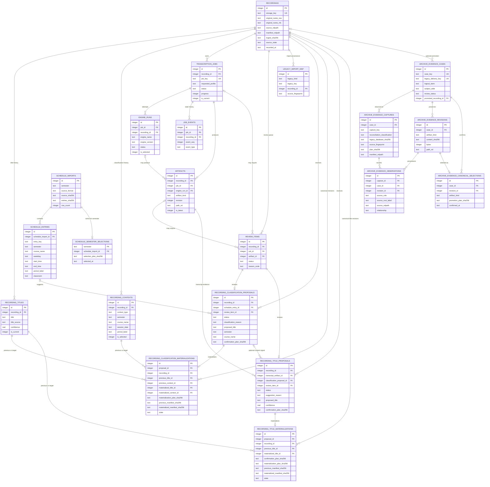

# Storage V2

목표는 원본/전사/교정본/요약본을 한 recording 단위로 묶고, 제목·과목명·학기 정보가 바뀌어도 물리 경로를 다시 바꾸지 않는 것이다.

## 핵심 원칙

- recording 하나가 immutable `storage_key` 하나를 가진다.
- 물리 루트는 항상 `records/<storage_key>/`다.
- DB에는 절대경로를 저장하지 않고 recording 루트 기준 상대경로만 저장한다.
- 사용자 표시 제목, 수업명, 날짜/교시, 검토 상태는 메타데이터다. 파일 경로 정본이 아니다.
- 기존 v1 `jobs`/`deliveries`와 운영 DB는 그대로 두고, v2는 additive하게 옆에 세운다.

## 물리 레이아웃

```text
records/<storage_key>/
  manifest.json
  source/
    original.<ext>
    # 과거 원본이 이미 정리된 경우에만:
    unavailable.json
  jobs/
    <job_key>/
      transcript.txt
      transcript.segments.json
      quality.json
      correction.txt
      correction.json
      summary.md
      engine/
        run-<engine_run_id>.json
```

여기서 `<storage_key>`는 내부 식별자다. 한국어 제목, 과목명, 날짜가 바뀌어도 유지한다.

## ERD



`OUTBOX_EVENTS`는 특정 테이블 FK 대신 `(aggregate_type, aggregate_id)`로 여러 aggregate를 가리키는 발행 큐다. `SCHEMA_MIGRATIONS`는 적용된 migration 버전과 현재 SQL 파일 SHA-256을 관리하므로 위 핵심 소유 관계도에서는 분리했다.

## DB 계약

- `recordings`
  - `storage_key`는 unique + immutable이다.
  - `storage_key`는 경로 안전한 ASCII 내부 식별자이고, 업로드 원본명은 `original_name_raw`와 NFC 정규화된 `original_name_nfc`에 별도로 보존한다.
  - `source_relpath`, `manifest_relpath`는 상대경로만 허용한다.
  - `source_state`는 `available` 또는 `missing`이다. 과거 cleanup으로 원본이 이미 없는 녹음도 전사·교정·요약 이력을 버리지 않고 `source/unavailable.json` metadata marker와 함께 보존한다.
- `recording_titles`
  - 표시 제목 이력을 저장한다.
  - current title은 recording당 1개만 허용한다.
- `recording_contexts`
  - 학기/과목/날짜/교시/메모/회의 같은 분류 컨텍스트를 저장한다.
  - selected context는 recording당 1개만 허용한다.
- `transcription_jobs`
  - 같은 recording에 대한 STT 시도 이력을 저장한다.
  - 경로에는 DB row id가 아니라 경로 안전하고 immutable한 `job_key`를 사용한다.
  - current job은 recording당 1개만 허용한다.
- `engine_runs`
  - 각 job 안의 실제 엔진 실행 이력을 저장한다.
  - selected engine run은 job당 1개만 허용한다.
- `artifacts`
  - transcript/quality/correction/summary 등 산출물을 저장한다.
  - `(job_id, recording_id)` 복합 FK로 job-recording 소속이 어긋나지 않게 막는다.
  - revision 충돌과 path 충돌을 둘 다 막는다.
  - job/kind별 latest revision은 1개만 허용한다.
- `review_items`
  - NEEDS_REVIEW, 수동 검토, 예외 정리 큐를 저장한다.
- `schedule_imports`, `schedule_entries`, `schedule_semester_selections`
  - 한 import는 정확히 한 학기를 소유하며 source format/SHA-256, normalized entry-set SHA-256, row count만 저장한다. Source file path와 CSV/JSON 원문은 저장하지 않는다.
  - entry는 NFC 과목명, 선택 과목 코드, 요일, 24시간제 시작·종료 시각, 교시, 강의실을 보존한다. Import/entry row는 update 불가이고 verifier가 row count와 entry-set digest를 다시 계산한다.
  - 학기별 selection row가 active import 하나를 가리킨다. 새 시간표 apply는 이전 import/entry를 삭제하지 않고 selection만 새 import로 전환하며, 목록·분류는 active entry만 사용한다.
- `recording_classification_proposals`
  - timetable과 recording time의 결과를 canonical title/context와 분리해 저장한다. `suggested`, `confirmed`, `rejected`를 구분하며 recording+semester당 active suggested/confirmed 하나만 허용하고 rejected 이력은 보존한다.
  - 유일한 시간 후보도 자동 확정하지 않고 open `review_items`와 함께 생성한다. 후보 없음·복수, recording time 부재/오류도 nullable schedule entry와 명시적 reason으로 검토 큐에 남긴다.
  - schedule/review가 proposal과 같은 semester/recording 소속인지 composite FK로 강제한다. Confirmation은 audit plan SHA-256과 시각을 남기고 review만 resolved로 바꾸며, confirmation 자체는 selected title/context나 manifest를 쓰지 않는다.
- `recording_classification_materializations`
  - 명시적으로 confirmed/resolved 된 `unique_time_match` 하나를 canonical title/context/manifest에 반영한 이력을 proposal당 하나의 journal로 저장한다.
  - 이전/새 title·context ID는 recording 소속 composite FK로 묶고, confirmation/materialization plan SHA-256과 이전/새 manifest SHA-256, closed metadata-only plan JSON을 보존한다.
  - `prepared`는 새 title/context row가 아직 inactive이고 manifest가 old 또는 exact target digest인 복구 구간이다. `applied`로의 단방향 전이만 허용하며 verifier는 prepared를 recovery-required로 보고한다.
- `recording_title_proposals`
  - Current transcript에서 만든 범용 제목 제안을 canonical title과 분리해 `suggested`, `confirmed`, `rejected`로 보존한다. Exact transcript artifact, 선택적인 timetable classification, 전용 review를 recording composite FK로 묶는다.
  - Confirmation은 exact inference를 재현한 audit digest와 resolved review만 남기며 그 자체로 canonical metadata를 바꾸지 않는다.
- `recording_title_materializations`
  - 명시적으로 confirmed/resolved 된 content-title proposal 하나를 canonical title과 manifest에 반영한 이력을 proposal당 하나의 삭제 불가 journal로 저장한다.
  - 이전 title과 새 `system` title의 recording 소속, confirmation/materialization plan SHA-256, 이전/새 manifest SHA-256, transcript·inference·linked-review 증거를 담은 closed private plan JSON을 보존한다. Transcript 본문은 저장하지 않는다.
  - `prepared`에서는 이전 title이 current이고 manifest는 old 또는 exact target digest여야 한다. `applied`에서는 이전 title을 이력으로 남기고 새 title만 current이며 manifest는 exact target digest여야 한다. 현재 revision은 timetable materialization journal과 한 recording에서 혼합하지 않는다.
- `outbox_events`
  - 알림/후속 처리 이벤트를 dedupe key로 정확히 한 번씩 발행하기 위한 버퍼다.
- `legacy_import_map`
  - `(legacy_kind, legacy_key)`와 source fingerprint로 v1 import를 재실행해도 같은 recording에 연결한다.
- `archive_evidence_cases`
  - 아직 recording identity가 없는 ownerless delivery의 독립 review queue다.
  - `case_key`는 immutable하고, canonical 승격 전에는 `promoted_recording_id`가 비어 있다.
- `archive_evidence_captures`
  - 특정 시점의 legacy DB hash, reconciliation classification, source fingerprint와 metadata-only snapshot을 immutable capture로 남긴다.
- `archive_evidence_revisions`
  - correction text/json과 summary markdown의 서로 다른 실제 바이트를 `(case, kind, sha256)`로 보존한다.
- `archive_evidence_observations`
  - 한 capture가 revision을 current GH, current Obsidian 또는 명시적 historical root 어디에서 관측했는지 기록한다.
  - capture/revision 모두 같은 case에 속하도록 composite FK로 강제한다.
- `archive_evidence_canonical_selections`
  - 사용자가 canonical로 명시 확정한 revision을 case/artifact kind별 하나만 저장한다.
  - `(revision_id, case_id, artifact_kind)` composite FK로 다른 case나 다른 kind의 revision을 선택하지 못하게 한다.
  - 선택 row는 update 불가이고, 모든 kind는 같은 promotion plan SHA-256으로 기존 recording 연결과 함께 기록된다.
- `schema_migrations`
  - 현재 migration SQL의 정확한 UTF-8 SHA-256을 저장한다.
  - repository는 현재 SQL로 만든 인메모리 canonical DB와 실제 DB의 table/index/trigger 정규화 서명을 비교한다.
  - checksum 또는 schema object가 달라지면 import와 read adapter 모두 fail-closed로 중단한다.

## manifest 계약

`manifest.json`은 file-system 쪽 정본 메타데이터다.

- recording identity: `storage_key`
- source file fingerprint: sha256, bytes, original filename
- selected title/context snapshot
- 모든 non-archived job의 key/status/profile/timing과 job별 선택 engine identity/timing metadata
- artifact index snapshot

DB row와 manifest는 같은 recording을 가리키되 역할이 다르다.

- DB: 검색, 상태 관리, 제약, 큐잉
- manifest: 파일 단위 이식성, 복구, 외부 동기화 단위

manifest는 recording 루트 안에서만 자기 파일을 참조해야 한다. 절대경로를 넣지 않는다. Recording 생성 시각, job queue/start/finish, engine start/finish와 선택된 engine의 optional stderr/log 상대경로도 DB와 교차 검증하는 provenance다. Source는 recording-level artifact이고, 그 밖의 active artifact는 정확히 한 manifest job에 귀속되며 해당 `jobs/<job_key>/` namespace 안에 있어야 한다. `body`, `content`, `raw_text`, `segments`, `transcript`, `transcript_text` key는 어느 중첩 깊이에서도 금지해 transcript 본문이 metadata manifest에 섞이는 것을 차단한다.

## 왜 경로를 제목 기반으로 두지 않나

이 프로젝트는 앞으로:

- 수업: `학기 > 날짜 + 수업명 + 교시`
- 일상 녹음: 맥락 기반 제목 자동 제안
- 시간표 import 기반 재분류

를 모두 지원해야 한다. 이때 제목/과목/날짜 추론은 나중에 바뀔 수 있다. 경로를 제목 기반으로 두면 rename cascade, 링크 깨짐, 중복 충돌, 한국어/NFD/NFC 문제가 계속 생긴다.

그래서 v2는:

- 물리 경로 = immutable storage key
- 사용자 표시명 = title/context metadata

로 분리한다.

## 호환 어댑터 방향

초기 단계에서는 기존 v1 파이프라인을 바로 지우지 않는다.

- v1 inbox polling/STT/downstream는 유지
- v2 import adapter가 완료된 recording만 병행 적재
- web panel / dashboard는 v1+v2를 동시에 읽는 호환 레이어를 둔다
- Hermes/후처리도 최종적으로는 `artifacts`와 `review_items`를 기준으로 옮긴다

즉, cut-over 전까지는 dual-read/dual-write가 아니라 preserve-first import + 점진 전환이 기본이다.

## Preserve-first importer

`src/lecture_stt/storage_v2/`와 `scripts/import_storage_v2.py`가 다음 경계를 구현한다.

- legacy DB 경로는 CLI에서 반드시 명시한다. regular file인 독립 snapshot만 허용하고 symlink, hardlink, 손상된 DB, 비어 있지 않은 `-wal`/rollback journal을 계획 단계부터 거부한다.
- snapshot은 `mode=ro&immutable=1`로 열기 전과 연결·조회 뒤에 본체 stat/hash와 WAL/journal/SHM 상태를 다시 확인한다. `PRAGMA quick_check`도 통과해야 한다.
- `01_audio`~`04_summarize`의 파일은 읽기·해시·복사만 하며 삭제, rename, overwrite하지 않는다.
- artifact 경로가 legacy root 밖이거나 symlink/비정규 파일이면 해당 recording을 fail-closed로 차단한다.
- 선택 필터나 `--limit`을 적용하기 전에 모든 legacy job과 delivery의 lineage·경로·inode claim을 조사한다. 같은 파일이 원본과 전사/교정/요약처럼 다른 역할로 해석되거나 서로 다른 canonical base에 공유되면 차단한다. 같은 녹음의 source 재시도 공유만 허용한다.
- delivery artifact는 `deliveries.source_job_id`로 소유자를 정한다. 중복 canonical base의 비소유 job에는 공유 산출물을 붙이지 않으며 owner가 모호하면 차단한다. ownerless delivery가 어느 job에도 매칭되지 않더라도 실제 교정/요약 파일이 남아 있거나 경로가 안전하지 않으면 무시하지 않고 discovery를 중단한다.
- `DELIVERED` artifact의 저장 SHA는 정본이므로 실제 파일과 다르면 차단한다. `BLOCKED`/`ERROR` 등 비성공 상태는 legacy가 SHA를 갱신하지 않을 수 있으므로 실제 파일을 보존하되 stale hash 경고와 open review를 남긴다. 잘못된 SHA 형식은 상태와 관계없이 차단한다.
- plan은 존재하는 파일의 device/inode/크기/mtime/hash와 부재해야 하는 경로의 parent identity를 함께 기억한다. target write 직전과 copy/skip/recovery 직전에 이 상태를 재확인하므로 plan 이후 파일 교체나 새 파일 출현은 재계획 없이는 통과하지 않는다.
- plan digest에는 legacy DB 본체 stat/hash와 sidecar snapshot도 포함한다. records-root lock 획득 뒤와 commit 직전에 다시 확인해 discovery 이후 legacy DB가 바뀐 plan을 적용하지 않는다.
- 신규 v2 DB와 records root는 legacy root 밖의 별도 경로만 허용하고 DB 파일을 records root 안에도 두지 않으며, target symlink도 거부한다.
- records root에는 exclusive import lock을 잡고, v2 DB write는 `BEGIN IMMEDIATE`로 직렬화한다. 하나의 v2 DB는 처음 결합된 records root와만 사용할 수 있으며, 알 수 없는 root entry·stale staging·예상하지 않은 lock file이 있으면 쓰기 전에 중단한다.
- 복사본은 `.staging`에서 SHA-256과 byte 수를 다시 확인하고 file/directory entry를 `fsync`한 후 신규 `records/<storage_key>`로 promote한다.
- promote 후 DB commit 결과가 불명확해도 final record를 삭제하지 않는다. 다음 실행은 manifest와 모든 artifact를 다시 검증한 뒤 누락된 DB row만 복구한다.
- `legacy_import_map`의 fingerprint만 같다고 skip하지 않는다. recording/title/context/job/engine/artifact/review/import-map DB row와 manifest, 실제 record tree가 모두 정확히 일치할 때만 idempotent skip한다. 같은 legacy key의 fingerprint가 바뀌거나 일부 provenance가 유실되면 자동 덮어쓰기하지 않는다.
- transcript 본문과 segment 배열은 plan/result/manifest에 넣지 않는다. 금지 key 검사는 manifest 전체를 재귀적으로 적용한다.
- v2 DB와 legacy DB가 같은 경로면 apply를 거부한다.
- CLI apply는 `--allow-write`, 현재 plan 수와 같은 `--expected-count`, plan에 출력된 정확한 `--expected-plan-sha256`을 모두 요구한다.
- 원본이 이미 없는 recording은 `--allow-missing-source`까지 명시해야 marker 방식으로 apply할 수 있다.

일관된 SQLite snapshot을 준비한 뒤 읽기 전용 계획:

```bash
PYTHONPATH=src .venv/bin/python -m lecture_stt.storage_v2 plan \
  --legacy-db /path/to/standalone/jobs.snapshot.sqlite3 \
  --legacy-root "$LECTURE_RECORDINGS_ROOT" \
  --job-id 306 \
  --json
```

`state/jobs.sqlite3`처럼 worker가 사용 중인 WAL DB를 직접 넘기지 않는다. Plan JSON의 `summary`, `plans`, `plan_sha256`을 함께 보관하고 검토한다.

검토한 일부 recording만 새 임시 v2 루트에 복사:

```bash
PYTHONPATH=src .venv/bin/python -m lecture_stt.storage_v2 apply \
  --legacy-db /path/to/standalone/jobs.snapshot.sqlite3 \
  --legacy-root "$LECTURE_RECORDINGS_ROOT" \
  --job-id 306 \
  --v2-db /path/to/separate/storage-v2.sqlite3 \
  --records-root /path/to/separate/records \
  --expected-count 1 \
  --expected-plan-sha256 <plan_sha256> \
  --allow-write
```

apply 후 DB/manifest/artifact 경로·크기·해시 검증:

```bash
PYTHONPATH=src .venv/bin/python -m lecture_stt.storage_v2 verify \
  --v2-db /path/to/separate/storage-v2.sqlite3 \
  --records-root /path/to/separate/records \
  --json
```

Verifier는 records root에 exclusive lock을 잡고 하나의 SQLite read transaction에서 canonical schema/checksum, `quick_check`, foreign key, recording/title/context/job/engine/artifact/review/import-map을 검사한다. Manifest와 artifact는 record-root dirfd 기준 `openat` + `O_NOFOLLOW`로 열고, 열린 descriptor에서 `fstat`·read·hash를 수행한다. DB에 없는 파일·디렉터리·symlink·special entry, orphan record directory, 비어 있지 않은 `.staging`, 예상하지 않은 `.locks` entry도 오류다. 재귀 검사는 깊이 64와 전체 entry 100,000개로 제한한다. 자동 삭제하지 않으므로 crash-window record는 같은 legacy plan을 다시 apply해 검증·등록 복구한 뒤 재검증한다.

`read_library_snapshot()`은 verifier/CLI용 read-only 요약 projection으로 유지한다.
웹 패널은 더 좁은 `storage_v2/library.py` adapter와 다음 독립 endpoint를 사용한다.

- `GET /api/storage-v2/library/recordings?limit=<0..200>&offset=<0..100000>`
- `GET /api/storage-v2/library/recordings/<storage_key>`

목록은 current title/selected context/current job, 상태 count, open review와 non-archived
artifact count만 반환한다. 상세는 non-archived job 50개, 그 job들의 artifact 500개,
review 100개를 상한으로 하고 전체 count와 truncation을 함께 반환한다. Artifact 상한은
current/newest job 순위를 먼저 적용한 뒤 job 안에서 stage/revision 순으로 선택한다. Artifact는
`source`, `transcript`, `correction`, `summary`, `supporting` stage metadata로만 묶으며
본문과 물리 폴더를 반환하지 않는다. Archived job/artifact correlation은 review에서
`null`로 닫아 숨겨진 revision을 역참조하지 않는다.

`storage_v2.library.enabled`가 실제 YAML boolean `true`일 때만 API를 열고 example
config는 기본 `false`다. 목록/상세 모두 SQLite `mode=ro`를 사용하고 numeric DB id,
source/artifact path, digest, transcript/correction/summary/scorecard body, review
detail JSON, job config/error를 응답하지 않는다. React 보관함은 목록과 선택 detail을
별도 on-demand query로 읽으며 화면 mount 뒤 fresh list 응답이 `available=true`를
재증명한 경우에만 cache된 목록/detail을 표시하고 detail을 요청한다.
Analytics attention의 `storage_key`는 `#library/<storage_key>`로 이 상세에 연결된다.

전사 관제용 projection은 별도 `read_transcription_analytics()`와
`GET /api/storage-v2/analytics/transcriptions?period=day|week|month`로 분리했다.
이 endpoint는 `/api/state`와 SSE에 포함되지 않으며 React 홈을 열었을 때 선택한
기간 하나만 읽는다.

- `day`는 `Asia/Seoul` 기준 오늘 00:00부터 현재까지를 24개 시간 bucket으로,
  `week`와 `month`는 오늘을 포함한 최근 7일/30일을 일 bucket으로 표현한다.
- archive되지 않은 recording의 current non-archived job만 집계한다. Event 시각은
  유효한 `recorded_at`, `received_at`, `queued_at` 순으로 fallback하고 각 사용
  비율을 coverage에 남긴다. 같은 timestamp parser를 SQLite deterministic UDF에도
  사용해 기간 필터를 `row_limit + 1`보다 먼저 적용하므로 미래/invalid 행이 정상
  in-window row의 상한을 선점하지 않는다.
- 상태별 양, 품질 점수 구간, 선택된 context/source 분류, 최근 attention 항목을
  같은 bounded in-window cohort에서 계산한다. `row_limit` 기본/최대는 5,000이고
  초과 여부를 `limits.truncated`로 명시한다.
- 점수는 latest non-archived `quality_scorecard`만 사용한다. Records root 아래
  `storage_key/path_rel`을 component별 no-follow open으로 읽고 regular single-link,
  stable stat, bounded bytes, exact integer schema version, kind/score/health/numeric
  metadata를 검증한다.
  읽은 bytes/SHA-256은 DB artifact metadata와 일치해야 하며 null/malformed/mismatch,
  깊은 JSON과 비현실적으로 큰 duration은 해당 row만 invalid로 격리한다. Missing과
  invalid scorecard는 별도 coverage와 `unscored` 구간으로 표시한다. Optional
  audio/processing duration 부분합은 각각의 known/jobs 표본 수와 함께 반환한다.
- 선택된 `recording_contexts`만 확정 분류로 계산한다. Suggested timetable/file-name
  inference는 자동 정본으로 보지 않으며 선택 context가 없으면 명시적 `미분류`
  bucket에 남긴다.
- 응답은 display name과 내부 `storage_key`를 분리한다. Source/artifact path,
  transcript/correction/summary 본문과 scorecard summary, error message,
  engine parameter는 반환하지 않는다.
- `storage_v2.analytics.enabled`가 실제 YAML boolean `true`이고
  `storage_v2.records_root`가 명시된 경우에만 읽기 경계가 열린다. Example config는
  기본 비활성화이며 이 문서 갱신 시점에는 운영 DB/root 연결이나 migration/cutover를
  수행하지 않았다.
- DB는 SQLite `mode=ro`로 schema/table write를 금지하면서 current WAL row를 읽는다.
  Main DB와 WAL의 bytes·size·mtime·ctime은 analytics read 전후 불변이어야 한다.
  SQLite read-lock coordination은 `-shm` bytes/mtime/ctime을 바꿀 수 있으므로 SHM은
  identity·mode·single-link·size 불변만 계약하며 immutable snapshot으로 부르지 않는다.

### 2026-07-23 read-only inventory

`state/backups/phase0-20260723T174053+0900/jobs.sqlite3` 독립 snapshot과 iCloud legacy root를 변경하지 않고 현재 importer로 계획만 다시 계산한 결과다.

- legacy jobs: 132
- importer 적용 가능 plan: 132
- blocking plan: 0
- 실제 원본 오디오가 남아 있는 recording: 41
- 원본 부재 marker가 필요한 recording: 91
- `needs_review`로 가져와야 하는 recording: 27
  - transcript pair 불완전: 26
  - 비성공 `BLOCKED` summary의 stale legacy SHA 경고: 1
- 중복 canonical base의 비소유 job에서 공유 downstream artifact를 제외한 recording: 1

과거 `deliveries` 원장은 247건이며 122건만 현재 legacy job을 명시적으로 소유한다. 나머지 ownerless/unmatched 125건은 현재 `03_correction`/`04_summarize` source file이 모두 부재한다. 이 행들은 임의의 recording에 귀속시키지 않지만, “보존 완료”로 간주하지도 않는다. 목적지 아카이브와 대조해 103건의 교정+요약 완료 이력과 22건의 교정 완료/요약 미완료 이력을 별도 reconciliation한 뒤 cut-over 여부를 결정한다.

이 수치는 snapshot 시점과 이후 파일 cleanup에 따라 달라질 수 있다. 실제 apply 직전에 새 일관 snapshot으로 plan을 다시 만들고 `--expected-count`와 `--expected-plan-sha256`을 모두 확인한다. 위 inventory에는 apply를 수행하지 않았다.

### 2026-07-23 archive reconciliation

Ownerless/unmatched delivery는 과거 절대경로를 그대로 신뢰하거나 임의의 recording에 붙이지 않는다. 다음 명령은 독립 snapshot과 현행 downstream route를 읽기만 한다.

```bash
PYTHONPATH=src .venv/bin/python -m lecture_stt.storage_v2 reconcile-archive \
  --legacy-db state/backups/phase0-20260723T174053+0900/jobs.sqlite3 \
  --legacy-root "$LECTURE_RECORDINGS_ROOT" \
  --config config/config.yaml \
  --json
```

검증 계약:

- 대상은 `source_job_id IS NULL`이고 어떤 `jobs.canonical_base`와도 일치하지 않는 delivery뿐이다.
- DB는 importer와 같은 `immutable=1` snapshot 검증을 사용하고 archive probe가 끝난 뒤에도 본체·WAL·journal·SHM 상태를 다시 확인한다.
- DB에 기록된 과거 iCloud GH/Obsidian 절대경로가 현재 configured root 밖이면 그 경로를 열지 않는다. 해당 값은 `destination_relocated` 정보성 provenance로만 남기고, 과목 route에서 결정적으로 계산한 현재 경로를 검증한다.
- 현재 경로는 root 이탈·symlink component·비정규 파일·hardlink를 거부한다. 파일은 `O_NOFOLLOW`로 열고 같은 FD에서 stat과 SHA-256을 계산한다.
- 저장 SHA와 현재 파일 SHA가 다르면 자동으로 정본을 선택하지 않고 `blocked`로 둔다.
- `summary_status=MISSING`이면 현재 GH/Obsidian 예상 경로가 모두 부재해야 `verified_correction_only`가 될 수 있다.
- 출력은 fixed metadata schema와 `observed_artifacts.path/sha256`만 포함한다. transcript/correction/summary 본문은 포함하지 않는다.
- delivery 5,000건, legacy job 10,000건, reconciliation 후보 2,000건, 출력 1,000건의 SQL/read 상한을 넘으면 fail-closed한다.

Phase 0 snapshot을 현재 archive에 대조한 결과:

- candidate: 125
- `verified_delivered`: 1 (`260309DStr_2`)
- `blocked`: 124
- 현재 correction txt/json은 125건 모두 존재하지만, 123건은 저장 delivery SHA와 다르다.
- `summary_status=DELIVERED` 103건의 현재 summary는 모두 존재하며, 47건은 저장 SHA와 같고 56건은 다르다.
- `summary_status=MISSING` 22건 중 9건은 현재 route에 summary가 존재하고 13건만 부재한다.
- 과거 절대경로가 현재 route로 이전된 사실은 456개의 정보성 `destination_relocated` evidence로 기록됐다.

이 결과는 124건의 현재 파일이 유실됐다는 뜻이 아니다. 현재 archive 파일은 존재하지만 과거 delivery 원장과 byte-for-byte 동일한 revision이라고 자동 증명할 수 없다는 뜻이다. 따라서 current archive bytes를 버리거나 원장 SHA로 덮어쓰지 않고, 후속 migration에서 현재본을 새 revision으로 보존해야 한다.

별도 읽기 전용 확인에서 과거 Obsidian recorded path에 아직 남은 파일은 2개였다. `260422Unix`는 현재본과 동일한 중복이고, `260430DStr_2`는 저장 SHA와 일치하지만 현재본과 다른 이전 revision이다. 후자는 과거 root 정리 전에 별도 revision으로 보존해야 한다.

### Archive-only evidence/revision queue

Ownerless delivery는 recording으로 만들지 않은 채 별도 evidence case로 먼저 보존한다.

```text
archive-evidence/
  .archive-evidence.lock
  .staging/
  cases/<case_key>/
    revisions/
      correction_text/<sha256>.txt
      correction_json/<sha256>.json
      summary_markdown/<sha256>.md
    captures/<capture_key>.json
```

읽기 전용 plan:

```bash
PYTHONPATH=src .venv/bin/python -m lecture_stt.storage_v2 plan-archive-evidence \
  --legacy-db state/backups/phase0-20260723T174053+0900/jobs.sqlite3 \
  --legacy-root "$LECTURE_RECORDINGS_ROOT" \
  --config config/config.yaml \
  --historical-root 'old_obsidian=/explicitly/allowed/historical/root' \
  --logical-stem 260430DStr_2 \
  --json
```

격리 target에만 apply:

```bash
PYTHONPATH=src .venv/bin/python -m lecture_stt.storage_v2 apply-archive-evidence \
  --legacy-db state/backups/phase0-20260723T174053+0900/jobs.sqlite3 \
  --legacy-root "$LECTURE_RECORDINGS_ROOT" \
  --config config/config.yaml \
  --historical-root 'old_obsidian=/explicitly/allowed/historical/root' \
  --logical-stem 260430DStr_2 \
  --v2-db /separate/path/storage-v2.sqlite3 \
  --evidence-root /separate/path/archive-evidence \
  --expected-count 1 \
  --expected-plan-sha256 <plan 출력값> \
  --allow-write \
  --json
```

계약:

- `blocked`/`manual_review` classification은 파일 보존을 막지 않는다. 해당 case를 recording에 연결하거나 canonical artifact로 선택하는 동작만 막고 `review_status=open`으로 둔다.
- current correction/summary 예상 경로는 상태와 관계없이 실제 파일이 있으면 관측한다. 따라서 legacy `summary_status=MISSING`인데 현재 summary가 있는 9건도 `unexpected_current` observation으로 보존할 수 있다.
- legacy DB recorded 절대경로는 어떤 `--historical-root LABEL=PATH` 아래에도 없으면 절대로 열지 않는다. 명시한 root와 current root가 겹치거나 historical root끼리 겹치면 plan을 거부한다.
- source는 root 이탈, symlink component, 비정규 파일, hardlink를 거부한다. 같은 열린 FD에서 SHA-256과 stat을 계산하고 plan에는 device/inode/mode/link/bytes/mtime/ctime을 포함한다.
- apply는 current/historical/legacy/evidence root가 겹치지 않는지 먼저 확인하고 count, full plan SHA-256, `--allow-write`가 모두 있어야 한다. root lock을 잡은 뒤 legacy DB snapshot과 모든 source state를 다시 검사한다.
- revision은 case/kind/content SHA 단위로 dedupe하지만 GH와 Obsidian처럼 같은 바이트를 여러 위치에서 본 provenance는 observation으로 각각 보존한다.
- 파일은 root 내부 staging에서 fsync한 뒤 no-replace promote한다. DB commit 전에 canonical schema, quick/FK, DB↔manifest↔revision hash, closed root inventory를 다시 검증한다. 파일 promote 후 DB commit이 중단된 경우 exact manifest와 revision만 recovery할 수 있다.
- capture manifest와 DB snapshot은 닫힌 allowlist다. Status/classification/flag/token은 지정 domain만, hash는 `null` 또는 canonical lowercase SHA-256만, artifact path는 canonical absolute path와 kind별 확장자만 허용한다. Reconciliation issue는 severity/code/field/path만 남기고 자유 형식 message/expected/actual은 보존하지 않는다. Observation `metadata_json`도 single-link regular source의 `device/inode/mode/links/bytes/mtime_ns/ctime_ns`만 허용한다. Apply와 verifier가 같은 스키마를 검사하므로 DB와 manifest를 함께 변조해도 본문성 값은 거부한다.
- `snapshot-archive-evidence`는 대시보드용 case/review/capture/revision 집계만 반환하며 source root와 본문은 반환하지 않는다.
- 웹 패널 backend는 `/api/storage-v2/archive-evidence/cases` 아래에서 on-demand 목록/상세/상태 변경/promotion plan/apply endpoint를 제공한다. 이 API는 실시간 `/api/events` payload에 포함하지 않아 유휴 상태의 DB 조회를 늘리지 않는다.
- 상세 응답은 revision kind/SHA-256/bytes/MIME, observation 수·role·relationship·최종 관측 시각과 capture classification만 포함한다. `snapshot_json`, source root/relpath, transcript/correction/summary 본문은 반환하지 않는다.
- Canonical 제안은 `matches_ledger` revision이 kind별 유일할 때 우선하고, 그렇지 않으면 최신 capture에서 current GH/Obsidian revision이 유일할 때만 제안한다. 여러 후보면 `unresolved`이며 자동 확정하지 않는다.
- Metadata-only canonical promotion은 기존 Storage v2 recording을 사용자가 지정해야 한다. Case의 모든 artifact kind에 revision을 정확히 하나씩 명시하고, latest classification이 `blocked`가 아니어야 한다. Plan은 `expected_count=1`과 stable SHA-256을 반환한다.
- Apply는 config의 `promotions_enabled`, 요청의 `allow_write`, 정확한 count와 plan SHA-256을 모두 요구한다. `BEGIN IMMEDIATE` 안에서 plan을 재계산한 뒤 canonical selection audit row와 `promoted_recording_id`, `review_status=resolved`를 함께 commit한다. Evidence/records filesystem을 복사·이동·삭제하지 않으며 정확히 같은 재적용만 `skipped`로 처리한다.

## 학기별 시간표 import와 분류 검토

시간표 파일은 웹으로 업로드하지 않는다. 로컬 UTF-8 CSV/JSON만 CLI에서 읽으며 canonical 필드는 `semester`, `course_name`, optional `course_code`, `weekday`, `start_time`, `end_time`, `period`, `classroom`이다. CSV는 같은 의미의 한국어 header도 허용하고, JSON은 row array 또는 `{semester, entries}` 형태를 허용한다.

```bash
PYTHONPATH=src .venv/bin/python -m lecture_stt.storage_v2 plan-timetable \
  --source /local/input/2026-1.csv \
  --json

PYTHONPATH=src .venv/bin/python -m lecture_stt.storage_v2 apply-timetable \
  --source /local/input/2026-1.csv \
  --v2-db /isolated/state/storage-v2.sqlite3 \
  --expected-count <plan-count> \
  --expected-plan-sha256 <plan-sha256> \
  --allow-write \
  --json
```

- Plan은 single-link regular source를 bounded read하고 현재 source SHA-256, normalized entry-set SHA-256, count와 stable plan SHA-256을 계산한다. 응답/DB에는 source path와 raw CSV/JSON body를 넣지 않는다.
- Apply는 같은 파일을 다시 읽어 count/digest를 검증한 뒤에만 별도 v2 DB에 쓴다. 같은 학기+entry-set의 재적용은 exact row metadata를 검증하고 `skipped`로 끝난다.
- 같은 학기에 내용이 달라진 새 import는 과거 import를 보존한 채 active selection을 교체한다. 이미 만들어진 suggestion은 자신이 참조한 import가 더 이상 active가 아니면 confirmation plan 단계에서 stale conflict로 거부한다.
- `plan-timetable-classification`은 명시한 학기의 entry와 active recording의 `recorded_at` 요일/시각만 비교한다. 기본 ±30분 margin은 CLI에서 0~120분으로 제한하며, transcript 내용 추론은 이 단계에 포함하지 않는다.
- `apply-timetable-classification`은 유일 후보도 `suggested` proposal과 open review로만 저장한다. 후보 없음·복수·recorded_at 부재/오류는 자동 이름 확정 없이 reason과 candidate entry key metadata만 review에 남긴다.
- 동일한 suggested 또는 confirmed proposal은 classification 재실행에서 멱등하게 `skipped`된다. 명시적으로 reject한 proposal과 dismissed review는 감사 이력으로 보존되며, partial unique index는 그 뒤 같은 recording+semester에 새 active suggestion을 만들 수 있게 한다.
- `plan-timetable-confirmation`/`apply-timetable-confirmation`은 유일 후보 suggestion에만 적용한다. Apply에는 `--enable-confirmation`, `--allow-write`, `expected_count=1`, 정확한 plan SHA-256이 모두 필요하다.
- Confirmation은 `status=confirmed`, confirmation plan SHA-256, confirmed time, resolved review를 기록하는 audit-only 단계다. `recording_titles`, `recording_contexts`, `records/<storage_key>/manifest.json`은 변경하지 않는다.
- 별도 CLI materialization만 confirmation 뒤의 canonical write를 수행한다. Plan은 현재 proposal/schedule, current title/selected context, manifest bytes와 전체 library verifier를 다시 확인하고 path나 본문을 포함하지 않는 `expected_count=1` plan SHA-256을 반환한다.

```bash
PYTHONPATH=src .venv/bin/python -m lecture_stt.storage_v2 \
  plan-timetable-materialization \
  --v2-db /isolated/state/storage-v2.sqlite3 \
  --records-root /isolated/records \
  --proposal-id <confirmed-proposal-id> \
  --json

PYTHONPATH=src .venv/bin/python -m lecture_stt.storage_v2 \
  apply-timetable-materialization \
  --v2-db /isolated/state/storage-v2.sqlite3 \
  --records-root /isolated/records \
  --proposal-id <confirmed-proposal-id> \
  --expected-count 1 \
  --expected-plan-sha256 <plan-sha256> \
  --enable-materialization \
  --allow-write \
  --json
```

- Apply는 CLI 전용이며 기본 비활성이다. Enable/allow/count/digest 중 하나라도 없거나 proposal이 더 이상 active timetable과 일치하지 않으면 어떤 journal이나 manifest도 만들지 않는다.
- 첫 transaction은 새 title/context를 inactive로 추가하고 journal을 `prepared`로 commit한다. 그 뒤 manifest parent를 dirfd/`O_NOFOLLOW`로 다시 열어 single-link regular file과 old digest를 확인하고, 같은 directory의 exclusive temp file을 `fsync`한 후 `os.replace`와 directory `fsync`를 수행한다. 두 번째 transaction에서 이전 row를 내리고 새 row를 current/selected로 올린 뒤 journal을 `applied`로 닫는다.
- 중단 뒤 같은 plan을 재실행하면 prepared journal과 old/new manifest digest를 검증해 앞 방향으로만 복구한다. 알 수 없는 digest, proposal target 변경, revision ownership/selection 불일치는 덮어쓰지 않는다. CLI exit 2는 pre-write refusal, exit 3은 prepared/applied write가 존재할 수 있는 recovery-required 상태를 뜻한다.
- Verifier는 journal plan의 closed field/domain, digest, proposal/review 상태, title/context row 내용과 체인, selection flags, latest manifest digest를 검사한다. Proposal 상세의 `canonical_metadata_changed`는 journal이 `applied`인 경우에만 true다.
- Dashboard backend는 `/api/storage-v2/timetable/entries`, `/api/storage-v2/timetable/classifications`, proposal 상세, `/status`, confirmation plan/apply를 on-demand로 제공한다. UI는 학기별 active entry와 `status=suggested` 검토 row를 표시하고, reject는 inline 재확인 뒤에만 실행한다. Confirmation은 read-only plan의 `expected_count=1`과 64자리 plan digest 전체를 먼저 표시하고 같은 guard를 재전송하는 명시적 apply로 분리한다. `/status`는 현재 `rejected`만 허용하며 `storage_v2.timetable.status_writes_enabled`와 요청의 `allow_write=true`를 모두 요구한다. CSV/JSON upload와 classification generation API는 의도적으로 제공하지 않는다. `enabled`, `status_writes_enabled`, `confirmations_enabled`는 YAML boolean `true`일 때만 열린다.
- Materialization plan/apply API와 웹 action은 아직 제공하지 않는다. 운영 DB/root에 적용하기 전에 CLI 격리 canary와 별도 승인이 필요하다.

### Transcript-content title suggestion and canonical materialization

`recording_title_proposals`는 학기와 schedule entry가 필수인 `recording_classification_proposals`를 범용 회의·대화·메모 제목에 재사용하지 않기 위한 별도 감사 원장이다. Current job의 latest `transcript_raw_text`, 선택적인 timetable classification, 전용 review item을 recording composite FK로 묶고 상태를 `suggested`/`confirmed`/`rejected`로 분리한다. Recording당 active suggested/confirmed proposal은 하나뿐이며 reject 이력 뒤에는 다시 제안할 수 있다.

```bash
PYTHONPATH=src .venv/bin/python -m lecture_stt.storage_v2 \
  plan-title-suggestions \
  --v2-db /isolated/state/storage-v2.sqlite3 \
  --records-root /isolated/records \
  --storage-key <optional-storage-key> \
  --json

PYTHONPATH=src .venv/bin/python -m lecture_stt.storage_v2 \
  apply-title-suggestions \
  --v2-db /isolated/state/storage-v2.sqlite3 \
  --records-root /isolated/records \
  --storage-key <optional-storage-key> \
  --expected-count <plan-count> \
  --expected-plan-sha256 <plan-sha256> \
  --enable-title-suggestions \
  --allow-write \
  --json

PYTHONPATH=src .venv/bin/python -m lecture_stt.storage_v2 \
  snapshot-title-suggestions \
  --v2-db /isolated/state/storage-v2.sqlite3 \
  --status suggested \
  --json
```

- Planner는 records root를 shared lock하고 storage key부터 artifact까지 각 path component를 dirfd+`O_NOFOLLOW`로 연다. Transcript는 regular single-link 파일, 기본 2MiB bounded read(호출 상한 16MiB), 읽기 전후 stable stat, DB `bytes`/SHA-256, strict UTF-8을 모두 만족해야 한다. Missing current transcript는 coverage에 남기고 건너뛰지만, DB에 index된 transcript의 unsafe path, symlink/hardlink, 크기·hash 불일치, read 중 변경, 잘못된 UTF-8은 batch를 fail-closed한다. V2 DB는 records root 밖에 있어야 한다.
- Current title source가 `manual` 또는 `schedule`이면 사용자/기존 정본을 보호해 새 proposal을 만들지 않는다. 정확히 하나의 active `unique_time_match` classification이 있고 transcript에 NFC-normalized course name 또는 course code가 실제로 포함될 때만 `날짜 수업명 교시` 구조를 `schedule_content_match`로 제안한다. 그렇지 않으면 외부 모델 없이 빈도와 첫 등장 순서로 고른 bounded keyword 2~3개를 valid `recorded_at` 날짜 및 이미 selected된 context label/type과 합쳐 `content_topic`을 제안한다.
- Public plan/snapshot과 review detail에는 transcript 원문·발췌, keyword 배열, artifact path, content digest, recording/job/artifact numeric id를 넣지 않는다. 사용자에게 필요한 bounded `proposed_title`만 내용 유래 값으로 남긴다. Plan SHA-256 계산에는 반환하지 않는 artifact id/path/hash/bytes와 classification id를 포함하므로 transcript가 바뀌었는데 우연히 같은 표시 제목이 나온 경우도 stale plan이 된다.
- Apply는 기본 비활성 `--enable-title-suggestions`, `--allow-write`, 현재 `expected_count`, exact plan SHA-256이 모두 필요하다. Read-only preflight 뒤 exclusive root lock과 `BEGIN IMMEDIATE` 안에서 DB/file plan을 다시 계산하고 proposal/review insert 뒤 commit 직전에 한 번 더 계산한다. 동일 active proposal은 `skipped`, 다른 active proposal은 conflict이며 어떤 경우에도 `recording_titles`, `recording_contexts`, manifest를 변경하지 않는다.

```bash
PYTHONPATH=src .venv/bin/python -m lecture_stt.storage_v2 \
  plan-title-suggestion-confirmation \
  --v2-db /isolated/state/storage-v2.sqlite3 \
  --records-root /isolated/records \
  --proposal-id <proposal-id> \
  --json

PYTHONPATH=src .venv/bin/python -m lecture_stt.storage_v2 \
  apply-title-suggestion-confirmation \
  --v2-db /isolated/state/storage-v2.sqlite3 \
  --records-root /isolated/records \
  --proposal-id <proposal-id> \
  --expected-count 1 \
  --expected-plan-sha256 <plan-sha256> \
  --enable-confirmation \
  --allow-write \
  --json

PYTHONPATH=src .venv/bin/python -m lecture_stt.storage_v2 \
  reject-title-suggestion \
  --v2-db /isolated/state/storage-v2.sqlite3 \
  --proposal-id <proposal-id> \
  --enable-status-write \
  --allow-write \
  --json
```

- Confirmation plan/apply는 records root에서 exact transcript artifact의 path/hash/bytes/stable stat/UTF-8을 다시 검증하고, 현재 manual/schedule title 보호·recorded timestamp·selected context·active timetable classification으로 제목 제안을 다시 계산해 저장된 proposal과 대조한다. 연결된 review의 job/artifact/reason/detail도 함께 검증한다. Confirmation digest는 이 current suggestion plan과 stable evidence를 묶으므로 같은 표시 제목을 만드는 metadata 변경도 stale로 거부하고, confirmed 멱등 replay에서도 사후 proposal 변조를 다시 검출한다. Apply는 write transaction 안에서 상태 전이 후 같은 계산을 commit 직전에 반복하며 stale/변조 evidence면 전이를 rollback한다. Reject는 suggested proposal을 rejected, review를 dismissed로 바꾼다. 둘 다 canonical title/context/manifest를 쓰지 않는다.
- Verifier는 proposal↔review↔transcript artifact/job 소속, active latest/current 상태, schedule-content link, closed detail key/domain/NFC와 suggested-confirmed-rejected review lifecycle을 검사한다.

Confirmation 뒤의 canonical write는 다음 별도 CLI에서만 수행한다. Plan 응답에는 transcript locator/hash/internal ID나 private journal evidence를 노출하지 않고 storage key, 이전/목표 표시 제목, `expected_count=1`, exact SHA-256만 반환한다.

```bash
PYTHONPATH=src .venv/bin/python -m lecture_stt.storage_v2 \
  plan-title-materialization \
  --v2-db /isolated/state/storage-v2.sqlite3 \
  --records-root /isolated/records \
  --proposal-id <confirmed-proposal-id> \
  --json

PYTHONPATH=src .venv/bin/python -m lecture_stt.storage_v2 \
  apply-title-materialization \
  --v2-db /isolated/state/storage-v2.sqlite3 \
  --records-root /isolated/records \
  --proposal-id <confirmed-proposal-id> \
  --expected-count 1 \
  --expected-plan-sha256 <plan-sha256> \
  --enable-materialization \
  --allow-write \
  --json
```

- Apply는 기본 비활성이고 confirmed proposal 하나에만 허용한다. Enable/allow/count/digest가 모두 맞아도 prepare 직전과 manifest 교체 뒤 finalize 직전에 DB·manifest·exact transcript bytes, 현재 inference, proposal과 linked review identity/detail/resolved 시각을 다시 확인한다. Stale proposal, current title drift, transcript drift, linked review 변경은 canonical title 전환을 거부한다.
- 첫 transaction은 기존 current title을 그대로 둔 채 새 `system` title revision과 `prepared` journal을 commit한다. Manifest는 기존 helper의 root lock, dirfd/`O_NOFOLLOW`, single-link regular 검사, 같은 directory temp `fsync`, `os.replace`, directory `fsync`를 사용해 title field만 바꾼다. 두 번째 transaction이 이전 title을 이력으로 내리고 새 title을 current로 올린 뒤 journal을 `applied`로 전환한다. Storage key, selected context, original/source/artifact path는 바꾸지 않는다.
- 중단 뒤 같은 count/digest/byte-limit으로 replay하면 prepared journal과 old/new manifest digest를 재검증해 앞 방향으로만 복구한다. 이미 applied인 materialized replay는 원래 current-title evidence로 inference를 재구성한 뒤 실제 target revision/manifest도 확인하고 `skipped`로 끝난다. 반면 일반 confirmation replay는 materialization으로 current title이 바뀐 사실을 stale evidence로 보고 거부한다.
- 한 recording에 timetable과 content-title materialization history를 섞거나 둘 이상의 content-title chain을 만드는 것은 현재 revision에서 fail-closed한다. Verifier는 journal plan/digest, proposal/review/transcript inference replay, title revision/selection, manifest digest를 교차 확인하고 `prepared`를 recovery-required로 보고한다. CLI exit 2는 write 전 refusal, exit 3은 durable journal이 생긴 뒤 guarded replay가 필요한 상태다.
- `/api/storage-v2/title-suggestions`는 이 원장의 목록·상세와 explicit reject, confirmation plan/apply를 노출하는 on-demand metadata API다. `storage_v2.title_review.enabled`, `status_writes_enabled`, `confirmations_enabled`는 각각 실제 YAML boolean `true`일 때만 열리며 기본값은 모두 `false`다. 목록과 상세에는 bounded 제안 제목, storage key, transcript revision, proposal/review lifecycle, 제안 당시 분류 상태와 현재 linked classification만 포함한다. Transcript 본문·발췌, artifact path/digest, recording/job/artifact numeric id는 포함하지 않는다.
- React workbench는 `#review/title/<canonical-positive-id>` deep link를 사용하고 mount 뒤 fresh 목록의 `available=true`를 확인한 뒤에만 상세를 읽는다. 첫 8건 밖 대상도 별도 metadata detail로 유지하며 보류는 2단계 확인, confirmation은 read-only plan과 exact `expected_count=1`/SHA-256을 먼저 표시한다. Capability가 꺼져 있으면 write 버튼은 비활성화되고 기본 비활성 deep link에서는 상세 요청을 보내지 않는다.
- HTTP confirmation도 audit-only이며 canonical title/context/storage key/manifest를 바꾸지 않는다. Proposal 생성과 canonical materialization HTTP endpoint/UI는 없고 Web upload도 추가하지 않았다.

Phase 0 전체 125건을 current root만 대상으로 다시 계획한 read-only 결과는 source safety blocking 0건, review 대상 124건, revision 362개, observation 474개였다. `summary_status=MISSING`인데 현재 파일이 있는 9건은 동일 물리 파일의 GH/Obsidian provenance를 각각 남겨 `unexpected_current` observation 18개가 됐다. 이 계산은 DB나 archive/evidence root를 만들지 않았다.

격리 canary `/private/tmp/lecture-stt-archive-evidence-canary-final3-20260724.DbCe3d`에서 `260430DStr_2` 한 건을 검증했다. Batch plan SHA-256은 `4f5db6f29dac82009817b3ce17a5d474caf924e5913ec8fab34cd045ae3cead0`이다.

- reconciliation classification: `blocked`이지만 source safety issue는 없어 apply 가능
- revision 4개: current correction txt/json, current summary, 과거 Obsidian summary
- observation 5개: current GH 3, current Obsidian 1, historical 1
- 과거 summary는 legacy ledger SHA와 일치하고, current summary는 서로 다른 SHA로 보존됨
- verifier issue 0, DB-only snapshot open case 1, 동일 plan 재적용 `skipped`

이 canary는 운영 v2 DB, current/historical archive, launchd, worker를 변경하지 않았다. 전체 125건 apply도 아직 수행하지 않았다.

### 2026-07-23 isolated import canary

운영 v2 경로가 아닌 `/private/tmp/lecture-stt-storage-v2-canary-20260724.4yWhwa`에서 legacy job 290 한 건을 실제 copy했다.

- plan: 1건, applicable 1, blocked 0, missing source 0
- imported recording: 1
- copied artifacts: 원본 오디오, transcript txt/json, quality scorecard, summary markdown 총 5개
- verifier: recording 1, artifact 5, issue 0
- 같은 plan 재적용: `skipped` 1, 신규 파일 0
- legacy snapshot DB와 원본 오디오 SHA-256은 canary 전 계획 값과 동일했다.

이 canary는 target-only copy 경로와 멱등성을 검증한 것이며 운영 v2 DB 생성, worker cut-over, launchd 변경, iCloud v1 파일 이동·삭제를 의미하지 않는다.

## import / rollback 원칙

- v1 `state/jobs.sqlite3`를 직접 migrate하지 않는다.
- migration 자체도 `jobs` 또는 `deliveries` legacy table이 보이면 persistent DDL 전에 abort한다.
- 아직 운영 v2 DB가 없으므로 archive evidence, timetable/classification materialization journal, content title proposal과 title materialization journal은 pre-release canonical `0001`에 포함했다. Migration checksum/schema signature가 바뀌었으므로 이전 `/private/tmp` canary DB는 upgrade 대상이 아니며 현재 migration으로 새로 생성한다.
- v2는 새 DB/새 테이블/새 루트로 만든다.
- import는 append-only manifest를 남겨 재실행 가능하게 만든다.
- rollback은 imported recording 단위로 수행한다. 하위 review/artifact/job을 개별 순서로 지우지 않고 recording root와 그 recording의 v2 row 집합을 하나의 단위로 정리한다.
- 원본 오디오와 기존 iCloud transcript/correction/summary는 import가 끝날 때까지 삭제하지 않는다.

## 지금 단계 범위

현재 구현된 범위:

- SQLite schema
- 제약 조건
- manifest/DB 계약 문서
- 임시 DB 기반 회귀 테스트
- legacy DB read-only discovery와 metadata-only plan
- no-overwrite copy, staging, hash verification, idempotent import
- 원본 부재 marker와 review item
- dashboard용 read-only library snapshot
- 기본 비활성·metadata-only recording library 목록/상세 API와 React revision 보관함
- import 후 전체 artifact verifier
- ownerless archive relocation/hash reconciliation
- recording-independent archive evidence case/capture/revision/observation queue
- archive evidence plan/count/digest/write guard, no-overwrite copy, verifier와 dashboard snapshot
- archive evidence review 목록/상세/상태 API, 보수적 canonical 제안, metadata-only guarded promotion
- archive evidence review API를 소비하는 React 검토 큐와 explicit plan/apply 화면
- CSV/JSON timetable plan/count/digest/write guard와 idempotent import
- recording-time 기반 suggested classification, no/ambiguous match review queue
- timetable/proposal metadata API, guarded reject/dismiss status transition과 audit-only guarded confirmation
- confirmed timetable proposal의 기본 비활성 CLI-only canonical title/context/manifest materialization과 prepared/applied forward recovery
- timetable/review API를 소비하는 React 시간표·분류 검토 화면
- `/api/storage-v2/review-feed`의 `storage-v2/unified-review-feed@2` 응답이 한 read transaction에서 archive evidence·suggested timetable proposal·suggested content-title proposal·recording open review를 정본화하는 metadata-only 통합 검토 index
- timetable/title full-table `review_item_id` 합집합을 distinct 차감한 뒤의 exact source total, stable server pagination, 네 source gate ledger와 page-bounded 응답
- 단일 unified feed query를 mount 시에만 읽고 서버 순서를 유지하는 React 이전/다음 pagination과 fresh-after-mount fail-closed gate
- canonical hash deep link를 통한 archive/timetable/title/recording workbench의 첫 페이지 밖 detail 연결
- verified transcript+recorded time+selected context+명시적 course signal 기반 CLI-only title plan/apply/snapshot
- 별도 `recording_title_proposals` suggested/confirmed/rejected 원장과 guarded audit-only confirm/reject
- confirmed content-title proposal의 기본 비활성 CLI-only canonical title/manifest materialization, 과거 title revision 보존과 prepared/applied forward recovery
- 기본 비활성·metadata-only title proposal 목록/상세 API, guarded reject/confirmation과 React title workbench
- 운영과 분리된 single-record import/verify/idempotency canary
- 운영과 분리된 single-case current+historical revision evidence canary

아직 포함하지 않는다.

- 운영 데이터에 대한 실제 v1 → v2 import 실행
- 기존 worker cut-over
- 운영 physical layout 전환
- content-title canonical materialization의 HTTP endpoint/UI와 다중 materialization chain
## Historical transcript recovery

- 과거 transcript 보관 root는 운영 records root와 별도로 명시한다. Plan은
  `<canonical_base>.txt`와 `<canonical_base>.json`만 direct child로 열고,
  symlink/hardlink/non-regular file을 거부한다. 각 파일은 bounded stable read,
  SHA-256/bytes, UTF-8, JSON 구조 검증을 통과해야 한다. 절대 source path와
  transcript 본문은 public plan이나 manifest에 저장하지 않는다.
- `plan-historical-transcript-recovery`는 read-only이며 `storage_key` 한 건,
  expected count 1, exact private plan SHA-256을 반환한다. Apply는
  `--enable-recovery`, `--allow-write`, `--expected-count 1`,
  `--expected-plan-sha256`가 모두 있어야 한다.
- 대상 recording은 current `needs_review` legacy-import job, succeeded selected
  legacy engine, open `legacy_import_review`, `transcript_pair_incomplete`와 양쪽
  missing issue, 현재 transcript artifact 0건을 모두 만족해야 한다. Apply
  직전 recording/title/context/job/engine/review/legacy map, manifest, historical
  bytes를 다시 비교한다.
- Prepare transaction은 selected engine 소유의 `transcript_raw_text`와
  `transcript_segments_json` revision 1을 insert하고 동일 transaction의
  `job_events`에 closed plan을 기록한다. 파일은 기존 job directory의
  journal-owned temporary file을 먼저 fsync한 뒤 atomic no-overwrite link로
  `transcript.txt`, `transcript.segments.json`을 publish하고 temporary link를
  제거해 최종 파일을 single-link로 고정한다. Publish 직후 cleanup 전 crash는
  같은 inode와 expected bytes를 확인해 복구한다. Expected bytes와 다른 temp는
  recovery 소유를 증명할 수 없으므로 자동 삭제하지 않고 보존·거부한다.
  Manifest는 해당 artifact index와 current job
  `artifact_paths`만 추가해 atomic replace/fsync하며 source/title/context/job
  status/review lifecycle과 `storage_key`는 바꾸지 않는다.
- `prepared` journal은 verifier에서 recovery-required issue다. 같은 source
  bytes, DB evidence, plan digest, 이전 또는 목표 manifest digest가 모두
  일치할 때만 replay한다. `applied` journal은 목표 manifest와 두 artifact가
  정확히 일치해야 하며 동일 apply는 `already_applied`로 끝난다. Source,
  review, title/context/job, destination file, manifest 또는 journal 변조는
  fail-closed한다.
- 복구 artifact의 media type에는
  `provenance=historical-transcript-recovery` parameter를 넣어 journal과
  독립적인 durable provenance를 남긴다. Verifier는 이 exact pair/path marker가
  있는데 prepared/applied event가 모두 사라진 경우 review detail이 이후
  변경됐더라도 missing-journal issue를 낸다.
- 이 경로는 missing transcript review를 자동 resolve하지 않는다. 원래 review
  detail은 import 당시의 보존 증거이므로 그대로 남고, 이후 사람이 별도 검토
  흐름에서 판단한다. 웹 endpoint/UI, upload, 원본 rename/move는 제공하지 않는다.
- V2 DB, records root, historical transcript root는 서로 겹치지 않아야 한다.
  Root 중첩은 lock 전에 거부해 자기 자신에 대한 중복 flock과 source/target
  alias를 막는다.
